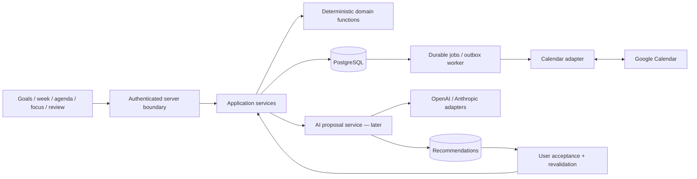

# Architecture proposal

Status: approved with review amendments, 2 October 2026. Phases 0–3B complete and approved; Phases 4A/4B implement Google CalendarList + FreeBusy advisory and independent Focusable Hours.

## Technical stack and trade-offs

| Concern | Proposed choice | Reason and alternative |
| --- | --- | --- |
| Web | Next.js App Router, React, TypeScript; Node runtime | One deployable app with server reads and interactive client forms. A separate API service adds no current value |
| Database | PostgreSQL, local Docker service; managed PostgreSQL later | Relations, transactions, ownership constraints, version checks; avoid SQLite parity differences for scheduling/concurrency |
| ORM | Drizzle and reviewed SQL migrations | Keep constraints and queries visible. Prisma is viable, but a second schema abstraction provides little benefit for this SQL-heavy model |
| Validation | Zod at transport and provider boundaries; domain validation in services | Types do not validate network input or business rules |
| Authentication | Better Auth + Drizzle database sessions from Phase 0; Google identity later | Owned database and portable deployment; compare Auth.js and Supabase in ADR 003 |
| Styling | Tailwind with small accessible components | No large design-system programme; forms, agenda, and tables first |
| Jobs, when external writes/background work require them | PostgreSQL-backed queue/outbox and a small worker using the same modules | Durable leases, retries, and status without Redis or microservices |
| Tests | Vitest, real disposable Postgres integration tests, Playwright critical flows | Domain rules, database semantics, and real reloads each need distinct evidence |
| Deployment | Node web process + Postgres; worker only when a later product slice requires durable work | Local first. Hosting vendor chosen when deployment is requested; no infrastructure provisioning now |

Select mutually supported stable package versions and an active Node LTS in Phase 0, record exact versions, and commit a lockfile. Do not assume a remembered framework patch or auth adapter API. The [Next.js installation guide](https://nextjs.org/docs/app/getting-started/installation) supports the proposed setup; run lint separately from the build. Drizzle supports [transactions](https://orm.drizzle.team/docs/transactions) and [migration workflows](https://orm.drizzle.team/docs/migrations); our choice is to generate, review, and apply migrations rather than push schemas into production.

## Boundaries and proposed repository layout

```text
src/app/                     pages, thin authenticated HTTP handlers, layouts
src/components/              forms, goal cards, week/agenda/review UI
src/modules/goals/           domain rules, application services, repository
src/modules/focus-cycles/    owned horizons, membership, lifecycle and current projection
src/modules/planning/        Phase 3A commitments, manual capacity, immutable baseline; later scheduling
src/modules/availability/    Phase 4B recurring hours and pure open-time advisory
src/modules/focus/           session lifecycle and actual effort
src/modules/reviews/         deterministic projections and reflections
src/modules/integrations/    connections, normalized contracts, sync orchestration
src/modules/coaching/        recommendation generation/acceptance; after MVP
src/providers/google/        Google payloads, OAuth, Calendar API mapping
src/providers/notion/        selective import; later
src/providers/openai/         AI payload mapping; later
src/providers/anthropic/      AI payload mapping; later
src/server/                  verified actor, database, configuration, errors
src/db/                      implemented schema and migrations, added by slice
src/jobs/                    deferred worker; absent in Phase 4A
tests/domain/ tests/db/ tests/e2e/ tests/contracts/
docs/
```

This is a future layout, not a request to scaffold empty modules. Add each module when used. Dependency direction: UI/HTTP → application services → pure domain functions and repository/provider interfaces → concrete infrastructure supplied at composition. Domain modules cannot import React, Next.js, provider SDK objects, or environment secrets. No generic repository framework or dependency-injection container is needed.



## Frontend/backend responsibilities

Server-render initial owned data; client components manage interaction and drafts. Begin with HTTP route handlers for mutations so error/status contracts and integration tests remain straightforward. Client validation helps the user but the server validates independently. React does not implement authoritative scheduling or capacity rules.

Each command resolves the actor from a verified session , validates the request, checks ownership and expected version, calls a service, commits atomically, and returns a narrow DTO. Use consistent errors: validation, unauthenticated, unavailable/not-found, version conflict, upstream unavailable, and unexpected failure with request ID. Do not expose another owner's resource existence. A successful mutation means a database commit; external publication remains a separate visible status.

Use mutation operation IDs to make retries safe, including after an acknowledgement is lost. Scope idempotency records to user + operation ID (ADR 008); include command kind in the payload hash and store the original successful result in the same transaction as the mutation. Reject reuse with a different payload. Use account-scoped/private reads and invalidate only the relevant user's views after mutations. No global caching of personal data.

## Persistence and concurrency

Use UUID app identifiers, explicit ownership on all owned entities, UTC instants for elapsed events, local dates for weeks/deadlines, IANA timezone names for calendar meaning, and integer minutes for estimates. Each mutable aggregate has an integer version. Update under owner + ID + expected version; conflict returns current data for explicit resolution. Foreign keys and unique constraints enforce same-owner relationships; state transitions remain in services.

Commitments and blocks use a weekly-plan aggregate lock while changing schedule or budget. Goal writes are ordinary atomic transactions. External operations use an outbox transaction, never a network call held inside a database transaction. Reviews read stored plan revisions plus actuals, not a reconstruction from today's edited tasks. Archive is reversible retention, not deletion. Schema tables are added per phase; the conceptual model is not a Phase 0 migration checklist.

## Authentication and credentials

Phase 0 establishes real Better Auth database sessions with email/password sign-in and operator-provisioned local accounts. Public sign-up is disabled; passwords are hashed by the library. There is no automatic development actor, impersonation route, or browser-supplied owner. Anonymous requests receive 401 from protected APIs and a sign-in redirect from protected pages. A server-only authenticated-user resolver validates the session against Postgres and returns a narrow actor. See [ADR 007](decisions/007-phase-zero-sessions.md) for this refinement of the earlier local-actor proposal.

The later Google Sign-In amendment permits new accounts through verified Google identities, as explicitly requested by the user. Email/password signup stays disabled. Matching verified emails use the supported Better Auth linking path; new emails create independent workspaces. See [Google Sign-In](google-sign-in.md) for the current policy and its tests.

The default runtime binds to loopback. Development provisioning is explicit, non-production, loopback-only, and never a web endpoint. Test credentials and database URLs live in ignored environment files; CI supplies its own disposable values. Production builds and a loopback production-process smoke test use real sessions, never a bypass. Remote deployment remains a separate operational decision.

Phase 4A leaves application sign-in unchanged; Google sign-in remains deferred. Application User/auth accounts and IntegrationConnection are separate: a connected Calendar account may differ from the Google login account. Only the separate “Connect calendar” action requests Calendar scopes. Bind that consent to the verified app actor. Reject email-only automatic account linking. Sign-out/account switches clear prior user data. [Better Auth's Next.js guide](https://better-auth.com/docs/integrations/next) distinguishes cookie presence checks from authorization; proxy redirects alone are insufficient.

Store integration credentials only on the server, encrypted with authenticated encryption and a key ID. Keep keys in environment/secret management, separate from the database; rotate by decrypt/re-encrypt. Use Google Auth Library for the independent Calendar OAuth flow and Node/OpenSSL authenticated encryption and ensure no plaintext integration tokens enter auth-account columns. No provider access/refresh token in browser DTOs, local storage, logs, URLs, or AI input. Serialize refresh per connection, retain an omitted refresh token only for the verified same subject on a still-connected grant, and persist rotations atomically. Revocation becomes reconnect-required rather than an infinite retry.

OAuth uses library-supported state/PKCE, exact allowlisted callbacks, validated return URLs, and short-lived state bound to actor/provider/intent. Use Secure/HttpOnly/SameSite session cookies as appropriate, validate origin/CSRF on mutation requests, and rate-limit sensitive endpoints. The simulated OAuth/client/schema flow is verified in Phase 4A; real consent and hosted OAuth configuration still require a separate deployment verification.

## Jobs and integration operation

Only when a later concrete product feature requires durable background work, implement one durable job table with type, dedupe key, owner/connection, minimal payload, attempts, next run, lease expiry, and status. Workers claim jobs transactionally, renew leases, and safely repeat after a crash. Deduplicate sync work per connection/calendar/window. Phase 4A uses on-demand FreeBusy and settings-entry CalendarList reads. Background polling, worker scheduling, webhook channels and renewal are deferred.

At Phase 5, add outbox calendar mutations and per-block serialized reconciliation. Mark blocks pending until confirmed; fail/conflict visibly. Retry transient failures with bounded exponential backoff/jitter and provider retry hints. Unknown write outcomes require a read/reconcile before another write. Worker deployment must be operational before a feature relies on durable jobs; request-scoped fire-and-forget promises are not a job system.

## AI boundary — after MVP

Provider SDKs implement a narrow PlanningAssistant contract. The service supplies a minimal user-approved planning/review context and validates a schema, ownership, referenced IDs, bounds, and rationale. Structured output makes a response parseable, not correct. Store a recommendation and its input revisions. Acceptance rechecks current state and deterministic constraints, then calls the ordinary command path; stale recommendations are rejected or regenerated. Models receive no calendar write capability. Record provider/model/prompt/schema versions and bounded usage metadata, not raw private prompts by default. [OpenAI structured outputs](https://developers.openai.com/api/docs/guides/structured-outputs) and [Anthropic structured outputs](https://platform.claude.com/docs/en/build-with-claude/structured-outputs) inform adapter mapping; no model choice is locked now.

## Errors, observability, and privacy

Use structured logs with request/job IDs, sanitized failure codes, durations, retries, and publication state. Avoid event titles, notes, OAuth codes, tokens, and model prompts in logs. Track sync age, failed jobs, ambiguous writes, conflicts, and duplicate-prevention outcomes. Surface reconnect/retry/conflict actions in the UI. Append compact activity entries for plan changes, accepted proposals, and external-write results from their respective phases; no full event-sourcing architecture.

Validate configuration on startup, use a least-privilege runtime database role, and separate migration privileges. Add database backup and restore verification before relying on a hosted pilot; a browser reload is not a backup. Phase 4A stores only CalendarList selection metadata and normalized busy timing, never source events. Phase 4A disconnect erases tokens/selection/cache and attempts revocation; later job features must also cancel work; deleting external focus events is a separate explicit action. Establish export/account deletion and retention rules before multi-user rollout. AI is off by default and connection does not grant implicit permission to send private context.

## Testing and engineering gates

- Domain tests for state transitions, estimate arithmetic, intervals, plan snapshots, acceptance, and actuals, with injected clock/IDs/provider fakes.
- Postgres tests for migrations, ownership, unique/check constraints, optimistic concurrency, idempotency, aggregate locking, and worker crash recovery. SQLite/in-memory tests cannot replace these.
- Playwright for goal CRUD/archive/reload, week selection, accepted scheduling, focus resume, and review→next-week workflows. Test an independent browser context to distinguish database persistence from browser state.
- Provider contract fixtures for current Google CalendarList pagination and FreeBusy validation; deferred event features need recurrence fixtures; later for AI refusals/malformed references and Notion import deduplication.
- Separate documented live Google sandbox verification; mocked OAuth tests cannot prove consent/refresh behaviour. No live credentials in CI.

Run lint, typecheck, unit/integration tests, critical browser tests, and production build in CI when implementation begins. Restrict time fixtures to known dates/zones and include both Europe/London DST transitions. See [build-plan.md](build-plan.md) for phase-specific evidence.

## Explicit time model

User.timezone is an IANA name validated with the standard Intl/Temporal ecosystem, never a custom timezone implementation. Store event/session instants as PostgreSQL timestamptz (unambiguous instants); store local deadline/week dates as date plus pinned IANA timezone where historical meaning requires it. User-facing days and Monday-to-Monday weeks use timezone-aware calendar boundaries, not fixed 24/168-hour arithmetic. Reject or explicitly resolve DST gaps/repeated local times. Clip events/segments spanning day/week boundaries; preserve elapsed seconds before display rounding.

All-day events retain provider-local date ranges with exclusive ends and source timezone. Transparent/free, cancelled, and declined occurrences do not consume busy capacity. Working hours, explicit breaks, minimum focus-block length, deliberate reserve, and optional later meeting buffers constrain focus-capable time beyond calendar free time. The exact rules and DST fixtures are in [planning-engine.md](planning-engine.md).

## Reviewed history, ownership, and lifecycle rules

Every owned aggregate carries an explicit owner; the verified actor supplies authorization, not browser user IDs. No teams, roles, organisations, or enterprise RBAC are introduced. Weekly commitments preserve planning-time estimates and goal/milestone/action relationships as snapshots; source entities stay mutable and links remain for navigation only. Closed plans remain meaningful even if source titles/estimates change or are archived. Rollover creates a new commitment referencing the old one. Committed effort, scheduled effort, and actual focused effort are three distinct measurements.

WeeklyPlan uses Draft → Committed only. Phase 3B appends immutable full-plan amendments under the Plan concurrency version; closing remains deferred. Later session transitions are enumerated in [domain-model.md](domain-model.md). Optimistic versions prevent lost writes. Actuals/corrections cannot overwrite commitment or schedule baselines.

Calendar ownership has three categories: external source-event read-only mirrors; internal TimeBlocks representing app intent; dedicated focus-calendar events projecting those blocks. Only the dedicated output calendar receives app-created events. Stable references plus app-specific private metadata identify exports. Initial writing detects and represents external modification conflicts; unrestricted bidirectional resolution is deferred. The integration document specifies full/incremental sync, token persistence/recovery, pagination/tombstones, resource versions, idempotency, safe retry, and partial-failure reconciliation. None of that runtime infrastructure belongs in Phase 0.

## Phase 0 implementation boundary and dependency lock

The implemented consumer is current-account context: HTTP/page → verified Actor → account service → owner-scoped Postgres repository. At Phase 0 the only tables were the auth adapter's app_user/auth_session/auth_account/auth_verification. Phase 1 adds Goal and MutationReceipt; Phase 2A adds Milestone; Phase 2B adds Action; all reuse the same receipt table. Phase 3A adds WeeklyPlan/WeeklyCommitment only; no IntegrationConnection, job, revision or outbox tables. Existing nullable OAuth columns are unused auth schema requirements, not Calendar credential storage.

Runtime: Node 24.14.0; Next.js 16.3.8; React 19.3.0; TypeScript 5.9.3; Better Auth 1.7.7; Drizzle ORM 0.45.3/Kit 0.31.11; pg 8.23.1; Zod 4.6.5; Tailwind 4.3.3; Vitest 5.0.3; Playwright 1.63.0. Exact direct and transitive versions are locked. PostgreSQL 16 is the supported local/test baseline and the cached official image available on this host.

The migration CLI's legacy loader brought esbuild 0.18.20 and a moderate dev-server advisory. A narrow override under @esbuild-kit/core-utils uses esbuild 0.25.12; migration generation and the clean-schema tests validate the override. It does not change runtime domain/auth dependencies. Public Yarn registry mirror configuration is project-local. No global registry settings are changed.

Phase 0 adds exact-origin enforcement on auth POST requests, including first login; sign-in throttles at ten attempts per minute. Cookie caching is disabled so revocation/expiry are checked against Postgres. The server-only context and account DTO never accept an owner from URL/body input. Production-process testing remains loopback; production deployment hardening/operations are not claimed complete.

## Phase 2A implementation boundary

Owned Goal detail and Milestone routes call the verified Actor → milestone service → owner-scoped PostgreSQL repository. Lifecycle/validation rules are in the domain/service layer. Writes use the same transactional receipt helper as Goals, with distinct `milestone.*` hash kinds and unchanged Goal hashes/receipt JSON. Each new Milestone write locks its owned parent before its child, preventing a concurrent Goal archive from accepting a later child change. Original successful receipts replay before current state checks. Phase 2A added no second idempotency table, event log, worker or integration. See [ADR 009](decisions/009-milestone-history-and-parent-locks.md).

## Phase 2B implementation boundary

Action HTTP/page → verified Actor → Action service → scoped PostgreSQL repository. Central effective mutability, relationship checks and lifecycle transitions remain outside React/routes. Only one owned Goal per Action, with optional active same-Goal Milestone. Parent terminal transitions preserve child rows, and read projections communicate their effective read-only state. Repeatable-read catalog queries prevent mixed parent/child read states.

All writes reuse atomic owner-scoped receipts with Action added to the DTO union only. New `action.*` hashes isolate kinds; earlier Goal/Milestone hashes stay unchanged. Receipt → Goal → sorted current/destination Milestones → Action locks serialize lifecycle/reassignment races; observed versions reject stale writes. New migration adds Action and the composite Milestone identity index required by its optional exact-Goal FK. No planning, calendar, actuals, AI or new framework. See [ADR 010](decisions/010-goal-aligned-actions.md) and [Phase 2B report](phase-two-b-report.md).

## Phase 3A planning boundary

HTTP/page → verified Actor → Planning service → owned PostgreSQL repository. Week/date, capacity, eligibility, source guards, commit validation and snapshots stay outside React/routes. Draft aggregate saves and commitment use the existing original-result receipts. Source locking follows existing Goal/Milestone/Action conventions after the Plan lock. Two planning tables preserve the original committed baseline; historical reads never depend on live source contents. [ADR 011](decisions/011-weekly-planning-immutable-baseline.md) supersedes earlier revision/lifecycle assumptions for this slice. Phase 3B now adds a separate amendment module as defined below. No scheduling engine, availability settings or integration is implemented.

## Phase 3B implementation boundary

`src/modules/amendments` owns full-snapshot generation, Effective Plan derivation, pure predecessor differences, read-only history and confirmation. Shared planning source locks and owner-scoped receipts retain the prior protocols. Two additive tables leave existing baseline storage intact. Concurrency advances only Plan.version, not baseline content/timestamps. Server reads use repeatable-read ownership scopes; the transient client editor cannot supply historical context. No generic revision platform, jobs or Calendar code is added. [ADR 012](decisions/012-immutable-weekly-amendments.md) records the approved representation.

## Implemented Phase 4A boundary

HTTP/UI → verified Actor → Calendar service → owner-scoped PostgreSQL repository and `CalendarAvailabilityProvider` → Google CalendarList/FreeBusy only. Three additive tables store one owned connection, short-lived consent claim and minimal last-successful availability cache. There are no event/cursor/job tables. Google account identity never supplies application ownership. Library-supported authorization-code + PKCE, exact callback configuration, actual scopes, encrypted offline credentials, safe reconnect and intentional disconnect preserve application authentication.

Calendar load is advisory occupied time. Pure Temporal-based week/day boundaries and interval union produce busy minutes only. Complete results replace cache; partial/failure preserves visibly stale previous timing, absence remains unknown. Cross-process owner advisory locks serialize credential refresh/configuration/disconnect outside network-spanning transactions. Read-only repeatable-read projections contain no secrets. All planning/source/history persistence is unchanged. [ADR 013](decisions/013-freebusy-advisory.md) supersedes the earlier assumed Phase 4 event-sync/job strategy; event mirrors/scheduling rules above are future options only. Google Auth Library 11.1.0 and @js-temporal/polyfill 0.5.1 are locked; the latter is a date/time library, not Temporal workflow infrastructure.

## Implemented Phase 4B — independent Focusable Hours

**Focusable Hours ≠ Calendar-open Focusable Time ≠ Manual Weekly Capacity ≠ Commitment Capacity ≠ Scheduled Time ≠ Actual Focus Time.** Owned recurring local windows describe willingness, not human capacity. Pure expansion/union/intersection/subtraction with the existing selected-calendar complete busy snapshot returns concrete advisory intervals and daily/weekly elapsed-minute totals. Manual capacity minus explicit reserve still determines commitment capacity. Nothing automatically changes a Draft, committed baseline, amendment, source or budget; extra open time creates no obligation.

`src/modules/availability` owns one optional versioned weekly configuration and pure derivation. ISO weekdays 1–7, integer minutes, 24:00 end, empty days/schedule, same-day overlap rejection, adjacent authored windows retained. Full-state saves reuse optimistic versions and atomic owner-scoped receipts. Current User IANA timezone controls live expansion, explicit Temporal compatible gap/fold resolution is explained in the UI, and half-open instant intervals preserve actual DST elapsed time. Derived intervals have no table or additional cache. Fresh/stale/unknown/incomplete status inherits Phase 4A coverage; disconnect retains hours and makes open time unknown. Finished weeks omit the live advisory; history is not reconstructed from today's preferences.

Read-only Calendar scopes/provider logic are unchanged. No TimeBlocks, scheduling, Calendar writes, one-off exceptions, buffers, minimum block size, automated capacity/reserve/amendment, focus/actuals, jobs or AI. Earlier future scheduling/daily-cap/override examples are proposals only; [ADR 014](decisions/014-focusable-hours-and-advisory-open-time.md) is authoritative for this slice. Exact results and next-slice proposal: [Phase 4B report](phase-four-b-report.md).

## Implemented Phase 5A: local operational schedule

`src/modules/scheduling` now provides pure placement evaluation, a receipt-aware service and owned PostgreSQL persistence. A small `commitment_identity` registry provides one relational target for existing baseline/amendment logical IDs; it does not replace Effective Plan derivation. `time_block` holds local intended work and frozen context independently of immutable planning history. Creation/rescheduling/cancellation never changes an Action estimate, commitment budget, capacity, reserve, baseline or amendment.

Final scheduling transactions serialize on the stable owner row with receipt-compatible NO KEY UPDATE, lock the owned Plan and recheck all local planned intervals. Block version checks prevent stale overwrites. A reviewed context digest and separate server acknowledgements bind hours/busy warnings to the current preview. No provider network call occurs in scheduling. Calendar/hours remain advisory; only local overlap, eligibility and interval validity are hard constraints. Plan-pinned wall time uses Phase 4B compatible DST semantics. See [ADR 015](decisions/015-local-time-blocks.md) and [Phase 5A report](phase-five-a-report.md). Earlier scheduling/export/revision examples remain future proposals and do not describe Phase 5A behavior.

## Phase 6A authoritative local execution contract

FocusSession belongs to one owned TimeBlock and inherits its frozen Plan/logical commitment/Action/Goal/optional Milestone context. Start/end use server time, the established receipts and shared owner lock. PostgreSQL enforces one active session per owner; ended history cannot be edited or reopened. Current User-local planning week only, regardless of exact planned clock time; dropped work requires explicit acknowledgement. Existing active sessions remain recoverable across midnight/week/restart and can end independently of amendments/source state.

Any session locks its TimeBlock's original planned interval/state against normal reschedule/cancel. Sequential sessions are allowed. Ended duration derives precisely from timestamps for every outcome; live Focus adds active elapsed only in labelled “so far” totals. Action estimate, commitment budget, scheduled time and recorded session time remain independent. No pause/segments/heartbeat, auto-timeout/completion, correction, review, suggestions, AI, external side effect or Calendar writing. Earlier focus roadmap examples are deferred and superseded for this slice. See [ADR 016](decisions/016-focus-sessions-and-execution-lock.md) and [Phase 6A report](phase-six-a-report.md).

## Phase 6B implemented semantics — 3 October 2026

Daily execution lives in the reviews module: a read-only repeatable-read projection joins owned TimeBlocks/pinned Plan zones, relevant Focus Sessions and one reflection. Reflection commands alone persist new review state. They reuse the owner-scoped receipt protocol and receipt → User NO KEY UPDATE → reflection lock order; the User lock is shared with Focus and scheduling. There is no network/provider call in the daily projection and no source mutation during reflection. Execution summaries are derived, not duplicated snapshots. See [ADR 017](decisions/017-daily-execution-and-reflections.md).

## Phase 7A — Weekly Review and Deliberate Rollover

Finished committed User-local weeks support one owned explicit-save Draft → terminal WeeklyReview. Derive every logical commitment ever present in the baseline/ordered Amendments, original/final summaries, independent scheduled and exact week-intersected Focus actuals, and daily reflection context. Seven-date finalized context uses DailyReflection.finalizedAt <= WeeklyReview.finalizedAt; later finalized daily text is excluded without copying bodies. Action lifecycle remains authoritative, with no scores or inferred completion.

Explicit Carry needs a fresh 1–10,080-minute proposal, Defer keeps work ordinarily available, Drop intentionally archives via the existing Action transition during atomic review finalization. Revalidate all inspected Action/parent guards; any conflict/failure rolls back Review, Drops and receipt. Finalized Carry is intent only: following-week Planning explicitly adds eligible work through the existing Draft-save transaction with owned review/decision proof, a fresh new-week identity and editable chosen budget. No automatic Plan, Amendment or rollover. [ADR 018](decisions/018-weekly-review-and-deliberate-rollover.md) is authoritative; [Phase 7A report](phase-seven-a-report.md) records verification. Stop after this slice and run a real full-week dogfood gate before choosing features.

## R5A: independent Focus Cycle context

`src/modules/focus-cycles` supplies strict pure schemas/rules, a small receipt-aware service and owned transactional persistence. `/api/focus-cycles` reads/creates and ID-scoped routes edit or explicitly Activate/Finish/Archive. They retain verified sessions, same-Origin mutations, bounded strict JSON and private/no-store responses. The module writes only its two tables and successful receipts. Mutable Goal joins and terminal membership snapshots distinguish current context from historical wording without rewriting upstream data.

Cycle commands lock the owner aggregate before cycle and ordered Goal rows. A database partial unique index defends one Active per owner; existing expected versions and receipts cover concurrent edits and uncertain responses. Current is derived in User timezone, inclusive of start/end, without jobs or automatic lifecycle changes. Shared server reads feed Goals, Calendar and Weekly planning; client discovery changes presentation only, never plan eligibility or schedule facts. [ADR 019](decisions/019-focus-cycles.md) and [report](ui-redesign-r5a-report.md) explain semantics and exact verification. Coaching remains outside this implemented module.

## R5B: optional explicit AI coaching

`modules/coaching` owns whitelisted facts, strict proposals, grounding, minimal runs and staleness. Server-only composition injects owned readers and existing read-only scheduling preview. OpenAI Responses and Anthropic Messages adapters request structured output and have no application mutation capability. Accepted scheduling uses the ordinary TimeBlock editor and transactional command. Calendar and Weekly Review share a compact optional panel; generation is explicit. [ADR 020](decisions/020-ai-coaching-proposals.md) defines privacy, single-flight generation and failure isolation. [R5B report](ui-redesign-r5b-report.md) records verification; broad chat/tool-loop ideas remain unimplemented.

## R5D: deterministic coaching signals and scheduling candidates

The owned reader captures request time and derives bounded factual signals, then generates future quarter-hour scheduling alternatives inside fresh Calendar-open Focusable Hours, subtracting local blocks. Each candidate reuses the ordinary scheduling preview before it can reach a provider. The model selects opaque signal/candidate IDs and writes bounded qualitative rationale. The server resolves heading, evidence, navigation and time fields. Numerical/temporal/history prose checks and reference validation fail closed; empty output succeeds. Current-plan source and block/history versions remain in a state hash, while the transmitted packet omits raw history, block rows, Action estimates and optional-source details. Exact time alone does not churn the context digest; candidate expiry and local-day rollover do. Preview and ordinary acceptance still require current deterministic validation. [R5D report](r5d-ai-quality-hardening-report.md) records live Haiku observations and remaining quality failures.

## R5E: optional owned ChatGPT inference connection

Better Auth continues to authorize One Better data. A separate ChatGPT registration stores validated subject/issued client ID, encrypted credentials, granted scopes and explicit model/provider selection. OAuth PKCE state is encrypted and one-time; host identity is durable ignored local configuration. PostgreSQL advisory locks serialize rotating refreshes across processes. The OAuth Responses adapter feeds the same R5D provider contract, signals, candidates, parser and acceptance path; it adds no model capabilities. See [ADR 022](decisions/022-chatgpt-plan-connection.md) and [live QA](r5e-chatgpt-openai-live-qa.md).

## R5F: deterministic Weekly Review evidence relationships

Review context version 3 derives provider-independent insight candidates from owned historical facts, current source/cycle truth, permitted finalized reflection support and bounded relevant following-week state. Providers select opaque IDs and supply interpretation/question only; all displayed Evidence is server-owned. The narrow parser preserves R5E safeguards, caps two insights and treats zero as success. Review state dependencies stale saved prose; stale and legacy broad Review prose are hidden until explicit regeneration. Calendar context, candidate semantics, preview and acceptance are unchanged. No schema migration or new domain mutation. See [ADR 023](decisions/023-weekly-review-insight-candidates.md) and [R5F live gate](r5f-weekly-review-evidence-quality.md).

## R5G: isolated Review usefulness comparison

A development-only loopback harness replays frozen R5F Review Evidence as A (Evidence), B (Evidence plus reviewed deterministic question), and C (Evidence plus existing validated AI prose). No normal app route/rendering, schema, provider request, prompt or Calendar behavior changes. A small experiment-only question library preserves existing candidate eligibility and stale/no-question semantics. Explicit user evaluations are recorded separately from disposable test answers; no automatic winner or productivity score. [R5G report](r5g-review-coach-usefulness-experiment.md) tracks the pending human decision and completion boundary.

## R6A multi-scale Calendar projection

Month / Week / Day share a selected account-local date in the Calendar URL. Month reads owned local blocks over a bounded display interval across original Weekly Plans; it does not define planning aggregates. Day uses the existing timeline and Focus entry with exact clipped recorded actuals. Original-plan details and scheduling commands preserve weekly identity, preview, receipts and execution locks. Week remains the primary three-region planning surface, with unchanged AI contracts. [R6A report](r6a-multiscale-calendar.md) records timezone compatibility, query behavior, verification and screenshots.
