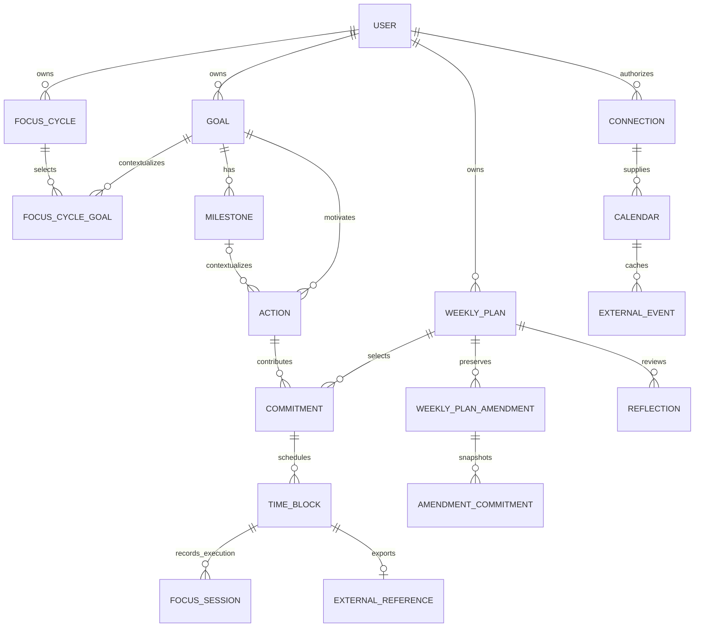

# Domain model

Status: approved with review amendments, 2 October 2026. This is a conceptual schema; add tables only when their slice begins.

## Main entities and conceptual columns

All owned entities carry an app ID, `user_id`, creation/update instants, and a version where mutable. User identifiers come from the server actor. Foreign keys must preserve ownership, using composite owner/ID keys where appropriate. Provider identifiers are opaque strings, separate from app UUIDs.

| Entity / first phase | Important fields and relationships |
| --- | --- |
| User / 0 | Better Auth-owned application ID, name/email, IANA timezone; identity accounts and sessions are separate tables; no organisations |
| Goal / 1 | Title, required intended outcome, nullable archived_at, version; outcome is text, not a separate entity |
| Milestone / 2A (implemented) | Exactly one immutable owned Goal, title, required successCondition, active/completed/archived, version, created/updated/completed/archived instants, optional plain-text evidence on completion |
| Action / 2B (implemented) | Exactly one immutable owned Goal, optional active exact-Goal Milestone; required title, optional doneWhen and effort estimate 1–10,080 whole minutes; open/completed/archived, version, lifecycle instants. No standalone Actions. |
| FocusCycle / R5A (implemented) | Owned title, optional intent, inclusive local dates, Draft/Active/Finished/Archived, version, created/updated/activated/finished/archived instants; one Active per owner |
| FocusCycleGoal / R5A (implemented) | Owned cycle + Goal membership, composite ownership FKs, stored Goal context snapshot; live context in mutable cycles, frozen at Finish/Archive |
| WeeklyPlan / 3A | Owner, local Monday date, pinned timezone, draft/committed, manually entered provisional capacity/reserve, version, creation/update/commit instants; unique owner/week |
| FocusableHoursSchedule / 4B (implemented) | Unique owned UUID aggregate, version, UTC created/updated, JSONB authored weekday/startMinute/endMinute windows; current User timezone interprets recurrence; not copied into Plan history |
| WeeklyCommitment / 3A | Owner, Plan, Action, separate weekly budget, source identity/version guard, nullable Draft snapshot frozen on commit, creation/update instants; unique Action per Plan; no lifecycle |
| WeeklyPlanAmendment / 3B | Owned Plan, unique positive sequence, required reason, capacity/reserve, creation instant and technical effective version; immutable full snapshot |
| AmendmentCommitment / 3B | Owned Amendment and Action, preserved logical commitment identity, unique Action membership, budget, source guard and required frozen context |
| Calendar / deferred event feature | Connection, remote calendar ID, timezone, access capability, selected_for_busy, app_created_output flag, sync health |
| ExternalCalendarEvent / deferred event feature | Calendar, remote event/occurrence IDs, normalized instant interval OR all-day date range+zone, busy flag, normalized response/status, remote version, snapshot generation |
| IntegrationConnection / future generalisation | Provider, provider account ID, scope set, connected/revoked/reconnect_required/disconnected, encrypted credentials+key ID, credential version, last_successful_sync_at, sanitized last_sync_error, revoked_at; independent of login identity; tokens inaccessible to DTOs |
| SyncSnapshot / deferred event feature | Calendar, covered instant range, fetched_at, complete/failed, generation; only complete generations feed capacity |
| Job / later durable work | Dedupe key, owner/connection, job type, minimal payload, attempts, lease, next run, queued/running/succeeded/failed |
| TimeBlock / 5A | Owned logical commitment and Plan, start/end instants, Plan-pinned display timezone, planned/cancelled, frozen snapshot, version/timestamps |
| ExternalReference / 5 | Connection, calendar, remote ID, local block ID, ownership marker, last confirmed remote version and interval, deletion tombstone; unique local export and remote identity |
| OutboxOperation / 5 | Block, operation key, desired version, create/update/delete, minimal desired payload, pending/confirmed/failed/ambiguous; same transaction as local change |
| ActivityRecord / 5 | Actor, entity reference, command, version, timestamp, sanitized result; compact audit, not authoritative event sourcing |
| FocusSession / 6A | Owner, required TimeBlock, authoritative started/ended instants, nullable active outcome/note, terminal completed/partial/abandoned, version and timestamps |
| FocusSegment / deferred proposal | Session, start/end instants, open/confirmed/needs_confirmation/excluded; paused time excluded; duration computed from segments |
| ActualCorrection / 7 | Session/segment, original and corrected bounds, reason, timestamp; retain correction evidence |
| Reflection / 7–8 | Daily local date or weekly plan, timezone, notes, optional goal evidence; one per owner/period with version |
| AIRecommendation / 9 | Kind, proposal payload, rationale, referenced revisions, provider metadata, proposed/accepted/rejected/stale/failed, acceptance command ID |
| ImportedSource / 10 | Connection, remote page/data-source IDs, external fields, import link to task/goal, provenance/last seen; deduplicated source record |
| MutationReceipt / 1 | Owner + mutation ID primary key, request hash (includes command kind/ID/version), original successful result snapshot, creation instant; atomic with corresponding write |

No separate DailyPlan, universal project entity, polymorphic external database, or general automation rules engine yet. The day view is a projection of blocks and actuals. Dedicated source/import records are introduced only when needed.

## Relationships

## Ownership and source of truth

| Data | Authority and reconciliation rule |
| --- | --- |
| Goal/action/commitment/reflection | App database; provider imports never overwrite local decisions |
| Ordinary calendar event | Provider; app keeps a read-only projection and cannot edit/delete it |
| Accepted focus block | App records desired interval, provider records observed published interval; discrepancies create a conflict, never silent overwrite |
| Focus actuals | Phase 6A authoritative session start/end instants in app; calendar presence never implies work happened. Segments/corrections remain deferred proposals. |
| Original plan | Phase 3A immutable committed Plan + Commitment snapshots; immutable full-plan amendments retain later intent |
| Imported Notion fields | External source record is provider-owned; app task/outcome is app-owned after explicit import |
| AI proposal | Untrusted recommendation; only a validated accepted command becomes app state |

Initial external edits to app-created events are detected and represented as conflicts without overwriting either version. Explicit adoption/restoration commands are later scope, not unrestricted initial bidirectional resolution. Remote deletion becomes a conflict/unpublished block and is not recreated automatically. Removing a selected calendar or losing permission invalidates its capacity coverage, not the user's goals.

## Key invariants

1. Every query and write uses the actor's ownership scope; related goal/task/plan/connection must have the same owner. No client-supplied owner is authoritative.
2. Goal title and intended outcome are trimmed, nonempty, and length-bounded. Archive retains the row and history.
3. Archived goals cannot receive new tasks/commitments. Existing running sessions may finish; historical actuals remain. Future blocks are not silently deleted: show a separate explicit cancellation/replanning action when those features exist.
4. A commitment must reference an open task when selected. It has a positive integer weekly budget; no separate weekly deliverable field in Phase 3A. A task can span weeks; at most one commitment for that task per week. Rollover creates a linked new commitment rather than moving the old one.
5. Plan timezone and week boundaries are pinned when committed. Changing the user's display timezone does not rekey plans/history. Prevent duplicate week plans even when timezone changes.
6. The Phase 3A baseline is immutable; later intent is appended as immutable full-plan amendments. Edits to task estimates/titles never rewrite original review evidence.
7. Phase 5A block intervals are half-open `[start,end)`, positive, future when placed, same local date and entirely inside the owning week. Active local blocks for one user cannot overlap. Outside recurring hours and known Google busy are acknowledged exceptions; scheduled minutes may exceed the commitment budget without changing it.
8. Scheduling rechecks current busy data and plan version. Validity depends on complete calendar coverage, not the mere existence of cached events. No ordinary external event is a calendar mutation target.
9. Phase 6A permits one active Focus Session per user, enforced by a partial unique index. Recorded duration derives from authoritative start/end for all outcomes; no pause/segments/timeout. Any execution locks the original TimeBlock schedule. Ending never completes an Action or parent.
10. Session outcome is user-reported context independent of Action completion; Phase 6A offers no inline/automatic completion command.
11. Publication status is separate from plan/session status. A queued calendar mutation is not “synced.” Desired changes and outbox intent commit together.
12. External identity is scoped by connection+calendar+remote event ID, with occurrence metadata retained. Tombstones prevent retries from resurrecting a cancelled block. Reconnect/410 recovery never deletes app goals/actuals.
13. Recommendation acceptance is idempotent, version-checked, owner-checked, and deterministic. Refused/malformed/stale AI output cannot mutate data.

## Conceptual database constraints and indexes

- Unique `(user_id,id)` keys for composite ownership foreign keys; unique `(user_id,week_start_date)` on weekly plans.
- Goal list index on `(user_id,archived_at,created_at,id)`; stable order by creation descending and ID. No unique title requirement.
- Unique `(plan_id,task_id)` commitment; positive estimate/budget checks; unique amendment sequence/membership and restrictive owned snapshot references.
- Block start/end check and PostgreSQL exclusion constraint on live owner/time range where practical, backed by aggregate locks for busy/budget validation. External busy data remains a service constraint.
- Unique remote calendar and external reference identities; snapshot generation indexes per calendar/range. Store source timezone/date values for all-day normalization.
- Partial unique active-session index, restrictive owned TimeBlock FK, positive ended interval and lifecycle checks, and immutable ended-history update trigger. Segment constraints remain deferred.
- Unique user/operation receipt and job dedupe keys; indexes on queued due jobs/lease expiry.
- Restrictive foreign-key delete behaviour for historical plan/actual records. Account erasure is a separate ordered operation, not casual cascade deletion from goal archive.

Snapshot payloads may be versioned JSONB with a validated schema, while live entities remain relational. Do not implement snapshot tables for unrelated entities or full change-data capture.

## Lifecycle examples

**Goal slice:** create “Ship a useful planning loop,” outcome “Use it to plan and review four real weeks,” save as version 1; edit outcome with expected version 1 to version 2; archive at version 3; active list hides it, archive view still retrieves it after restart. A stale edit from version 1 conflicts and cannot unarchive it.

**Weekly plan:** an action estimates 240 minutes remaining. This week's commitment budgets 120 minutes for a concrete sub-outcome. Commit revision 1; schedule two 60-minute blocks in revision 2 without rewriting revision 1. Moving a block later creates another revision; compare initial committed schedule (first accepted schedule snapshot, retained separately within revisions) with current schedule and actuals. If only 75 minutes are recorded, keep that effort and explicitly mark the deliverable partial.

**Replanning:** the user chooses to carry the partial action forward with a new 90-minute budget. The next-week commitment references its predecessor; the old 120-minute commitment and actuals remain in the old week. No hidden accumulation.

**Calendar failure:** accepting a block commits its pending row and outbox intent. Google creates the event but the response is lost. The worker reads the stable remote ID, verifies the ownership marker, and records confirmation instead of inserting again. A simultaneous external edit produces a conflict for the user.

**AI later:** a recommendation references plan version 8. While it is displayed, a meeting arrives and plan version becomes 9. Accepting it fails as stale and presents a fresh preview; the earlier prose does not grant permission to force a collision.

## Planning-time snapshots versus live source references

Phase 3A Draft commitments record the source Action ID, separate budget, and Action/Goal/optional Milestone version/relationship guards. Display may use live context. Source edits and active-Milestone moves require explicit review; terminal work cannot commit. Commitment atomically freezes Action title/done condition/estimate, Goal identity/title/outcome and optional Milestone identity/title/success condition. Plan capacity/reserve and budgets freeze with it. Committed reads use snapshots without source-content joins. There is no commitment order, deliverable/completion state, Plan revision table, amendment, closing or rollover in this slice. Later amendment representation remains a decision for Phase 3B.

Rollover_source_commitment_id links a newly created next-week commitment to its old source. The source's plan/week, budget, snapshots, and outcome stay unchanged. Focus actuals reference context but cannot change original committed effort or scheduled effort.

## Legal lifecycle transitions

Statuses are constrained enums/checks plus domain transitions, not arbitrary strings. Mutations use expected versions; terminal states cannot reopen without a separately specified future command.

| Aggregate | Legal transitions / rules |
| --- | --- |
| FocusCycle | Draft → Active → Finished; explicit Archive from Draft/Active/Finished; Archived terminal. Draft/Active editable, dates inclusive, one Active per owner even after expiry |
| Goal | active → archived (retained); no restore; Milestones and Actions remain unchanged and read-only |
| Milestone | active → completed OR active → archived; both terminal; edits only active under active Goal; no automatic Goal change |
| Action | open → completed OR open → archived; both terminal; only Open under active Goal and absent/active Milestone may change; no standalone or Goal moves |
| WeeklyPlan | draft → committed; baseline content remains terminal. Immutable amendments append only; no reopening/closing |
| WeeklyCommitment | Phase 3A has no own lifecycle; Draft rows edit only under Draft Plan and freeze with Plan commitment |
| FocusSession | active → ended with exactly one completed/partial/abandoned outcome and optional end note; ended immutable; start another session to return to a block |
| TimeBlock | Phase 5A planned → cancelled, terminal; past-started records preserved. Any Focus Session additionally locks normal reschedule/cancel; execution is a derived lock, not a new block lifecycle state. No publication state exists. |
| IntegrationConnection | connected → revoked/reconnect_required/disconnected; explicit successful reconnection → connected; credentials and scope changes versioned |

Goal archive never cascades deletion through historical commitments, revisions, blocks, or actuals. External deletion produces tombstones/conflicts, not deletion of app history.

## Time model and capacity vocabulary

Use IANA User.timezone and library/Intl validation; no custom timezone system. Actual event/session instants use timestamptz; local day/week/target dates retain local meaning. Weeks start Monday in the pinned timezone. DST changes mean days/weeks need not be 24/168 elapsed hours. All-day ranges preserve source-local dates and timezone; normal events crossing boundaries are clipped. Phase 6A session elapsed time stays with its original block/commitment, without daily splitting; daily allocation is deferred. Exclude transparent/free/cancelled/declined source events from busy time. Working hours/breaks, reserved capacity, minimum block length, and optional later buffers further restrict placement.

Calendar-open Focusable Time is the union of explicit recurring windows minus the selected-calendar busy union. Manual capacity is independently entered human judgment. Commitment capacity is manual capacity minus protected reserve. Minimum fragments and daily caps remain future proposals. Committed effort is the selected weekly budgets; scheduled minutes are accepted TimeBlocks; recorded session time derives from authoritative ended-session intervals for every outcome. Only the active Focus display additionally includes live elapsed time, labelled “so far.” None implies another automatically. The application should make under-committing easy.

## Implemented Phase 2A contract

Milestone title is 1–160 Unicode code points and successCondition is 1–2000; both trimmed and required. Optional evidence is 1–2000 plain-text code points, trimmed, with blank/missing normalized to null. All instants use timestamptz and UTC DTO strings. Composite `(owner_id, goal_id)` references Goal's `(owner_id, id)` with restrictive deletion; parent ID is never accepted by edit commands or rewritten by persistence.

Only active Milestones can edit or transition, and only beneath an active Goal. `active → completed` sets completedAt and optional evidence; `active → archived` sets archivedAt. Both increment version and are terminal; completed definitions/evidence and archived definitions remain immutable. Goal archival neither changes nor removes children; all three states remain readable as history. Completing a Milestone never modifies Goal fields/version. There is no percentage, order, date or task behaviour. See [ADR 009](decisions/009-milestone-history-and-parent-locks.md) for locks and receipt replay.

## Phase 2B implemented Action rules

Every Action carries server-supplied ownerId and required immutable goalId. Optional milestoneId can change among active milestones in that exact Goal or null only while effectively mutable. Composite owned Goal and (owner, Goal, Milestone) foreign keys prevent cross-owner/cross-Goal links. Standalone/inbox work is explicitly excluded, superseding earlier tentative proposals.

Effective mutability is centrally calculated: Open + active Goal + no milestone/active milestone. Open→Completed or Open→Archived are terminal, expected-version transitions. Completed/Archived definitions/context/estimates cannot change or reopen. Goal archive and Milestone complete/archive leave Action rows unchanged; even an Open Action is historical/read-only beneath a terminal parent. Detaching/reassigning cannot evade this rule. Completion has no evidence requirement and never completes a parent or changes numerical progress.

Title is 1–160 and optional doneWhen up to 2,000 trimmed Unicode code points. Optional estimateMinutes is 1–10,080 whole minutes, independent of commitment budgets, scheduled time, actual time or progress. Edits replace the four editable fields and increment version once. All four commands reuse atomic owner-scoped receipts; successful original snapshots replay before later lifecycle checks. Lock order: receipt → Goal → sorted current/destination Milestones → Action. Reads use one repeatable-read snapshot and return server-derived mutability/valid selectors. See [ADR 010](decisions/010-goal-aligned-actions.md).

## Implemented Phase 3A contract

See [ADR 011](decisions/011-weekly-planning-immutable-baseline.md) and the [completion report](phase-three-a-report.md). PostgreSQL `date` stores the Monday identity. IANA timezone is pinned at creation; current-week calculation uses the current account timezone. Capacity and budget are 1–10,080 whole minutes; reserve is nonnegative and strictly below capacity; at most 50 selected Actions. Full-state saves and commit share one Plan version and existing owner-scoped receipts. Sources remain unchanged. Committed baselines remain meaningful indefinitely, including beneath terminal parents. Earlier active/closed lifecycle and revision examples in the conceptual future roadmap are not implemented or authorization for Phase 3A/3B.

## Implemented Phase 3B contract

Effective Plan equals the highest amendment sequence or the baseline when none exist. Retained snapshots and logical commitment IDs carry forward exactly; only explicit budgets change. Only newly added Actions require current owned effective eligibility and source-guard validation. Re-add after a previous amendment dropped an Action captures fresh context/new identity. Required reasons use the existing 1–500 Unicode code-point text validator. Pure differences match Action identity and do not persist event records.

Only current/future committed weeks may amend using the current User IANA timezone; pinned Plan timezone still governs historical display. Amendment capacity is 0–10,080 minutes; zero requires zero reserve and zero commitments, otherwise reserve < capacity. Positive budget bounds/nonempty original commitment rules remain unchanged. No-op and over-capacity amendments reject. Baseline planning content, original timestamps and original Commitment rows never change; only Plan.version advances as concurrency metadata. Each amendment's version is the immutable version at creation, not an editable revision. See [ADR 012](decisions/012-immutable-weekly-amendments.md).

## Implemented Phase 4A — busy-only context

GoogleCalendarConnection belongs to the verified application User, independently of authentication accounts. One row per owner records connected/reauthorization_required/disconnected, technical version, optional provider subject, encrypted credential envelope, expiry, actual grants, minimum readable CalendarList metadata and explicitly selected IDs. CalendarOAuthFlow has owner, unique state hash, encrypted PKCE verifier, ten-minute expiry and consumed safe outcome. CalendarAvailabilityCache has owned connection, Monday date, current User timezone, selection fingerprint, merged timing, last successful fetch and sanitized failure marker. There are no event resources or Plan references in these tables.

No automatic selection/capacity/reserve/budget/membership/source/history mutation. Cache is external context, not planning-history truth. Same-account reconnect repairs the one row; verified subject change clears selection. Selection caps at 50 and checks observed version; unknown/inaccessible selections require review. Disconnect retains only non-secret connection status/identity, removes secrets/config/cache/pending flow and attempts provider revocation.

Half-open offset-bearing instants normalize via Temporal; clip, sort, merge overlaps/nesting/adjacency, split on actual local-day boundaries, preserve precise elapsed duration. Report busy minutes only, never 168h minus busy or human focus capacity. Missing/malformed/per-calendar errors cannot become an empty successful response. A complete empty response is zero occupied minutes. Old complete cache retains fetchedAt and becomes stale after a failed refresh or 15 minutes; selection changes invalidate it. [ADR 013](decisions/013-freebusy-advisory.md). All event-level entities/semantics above remain deferred options.

## Implemented Phase 4B — independent Focusable Hours

**Focusable Hours ≠ Calendar-open Focusable Time ≠ Manual Weekly Capacity ≠ Commitment Capacity ≠ Scheduled Time ≠ Actual Focus Time.** Owned recurring local windows describe willingness, not human capacity. Pure expansion/union/intersection/subtraction with the existing selected-calendar complete busy snapshot returns concrete advisory intervals and daily/weekly elapsed-minute totals. Manual capacity minus explicit reserve still determines commitment capacity. Nothing automatically changes a Draft, committed baseline, amendment, source or budget; extra open time creates no obligation.

`src/modules/availability` owns one optional versioned weekly configuration and pure derivation. ISO weekdays 1–7, integer minutes, 24:00 end, empty days/schedule, same-day overlap rejection, adjacent authored windows retained. Full-state saves reuse optimistic versions and atomic owner-scoped receipts. Current User IANA timezone controls live expansion, explicit Temporal compatible gap/fold resolution is explained in the UI, and half-open instant intervals preserve actual DST elapsed time. Derived intervals have no table or additional cache. Fresh/stale/unknown/incomplete status inherits Phase 4A coverage; disconnect retains hours and makes open time unknown. Finished weeks omit the live advisory; history is not reconstructed from today's preferences.

Read-only Calendar scopes/provider logic are unchanged. No TimeBlocks, scheduling, Calendar writes, one-off exceptions, buffers, minimum block size, automated capacity/reserve/amendment, focus/actuals, jobs or AI. Earlier future scheduling/daily-cap/override examples are proposals only; [ADR 014](decisions/014-focusable-hours-and-advisory-open-time.md) is authoritative for this slice. Exact results and next-slice proposal: [Phase 4B report](phase-four-b-report.md).

## Phase 5A authoritative TimeBlock contract

`TimeBlock`: UUID, owner, Plan, logical commitment, UTC start/end, planned/cancelled, positive version, frozen PlanningSnapshot and created/updated/cancelled timestamps. `commitment_identity` registers existing logical IDs with an owned Plan foreign key; TimeBlock's composite foreign key fixes both ownership and Plan membership. Existing carry/budget amendments retain IDs; drop/re-add creates new membership. No earlier baseline/amendment/receipt schema or content changes.

Only current Effective Plan commitments in committed current/future weeks can create/edit future blocks. A removed future commitment's blocks remain review-required and intentionally cancellable; past/finished/terminal records cannot change normally. Labels stay frozen. Active half-open local intervals cannot overlap across an owner. Scheduled elapsed minutes are derived independently and can exceed or fall below budget. Outside-hours and known Google busy require separate explicit acknowledgements; stale/unknown coverage is labelled rather than free. Cancellation retains the row. All previous conceptual elapsed/publication states and working-window/budget ceilings are deferred and superseded by [ADR 015](decisions/015-local-time-blocks.md) for Phase 5A.

## Phase 6A authoritative local execution contract

FocusSession belongs to one owned TimeBlock and inherits its frozen Plan/logical commitment/Action/Goal/optional Milestone context. Start/end use server time, the established receipts and shared owner lock. PostgreSQL enforces one active session per owner; ended history cannot be edited or reopened. Current User-local planning week only, regardless of exact planned clock time; dropped work requires explicit acknowledgement. Existing active sessions remain recoverable across midnight/week/restart and can end independently of amendments/source state.

Any session locks its TimeBlock's original planned interval/state against normal reschedule/cancel. Sequential sessions are allowed. Ended duration derives precisely from timestamps for every outcome; live Focus adds active elapsed only in labelled “so far” totals. Action estimate, commitment budget, scheduled time and recorded session time remain independent. No pause/segments/heartbeat, auto-timeout/completion, correction, review, suggestions, AI, external side effect or Calendar writing. Earlier focus roadmap examples are deferred and superseded for this slice. See [ADR 016](decisions/016-focus-sessions-and-execution-lock.md) and [Phase 6A report](phase-six-a-report.md).

## Phase 6B implemented semantics — 3 October 2026

DailyReflection: id, ownerId, localDate, status (draft/finalized), one plain-text note, version, createdAt, updatedAt, finalizedAt nullable. Unique owner/localDate, owner FK, bounded canonical date/note, valid lifecycle/timestamps and a focused UPDATE trigger protect identity/date/creation/version increments and finalized text. Draft may be empty and edited repeatedly; finalization requires a saved non-empty note and is terminal. No product delete, reopen or correction. Reflections store no execution totals or source snapshots.

Daily Execution: requested calendar date in current User timezone, exact local midnight boundaries, scheduled blocks (including cancelled explanatory history), intersecting actual sessions, factual totals/outcome counts and frozen context. Cross-midnight sessions contribute only their interval overlap; an active past-day contribution is fixed while today's is live. If User timezone changes, the same date's projection follows the new zone; pinned Plan/block instants are preserved, and a block that now spans two User dates is split by interval intersection for scheduled totals. A reflection retains its calendar-date identity; no timezone-history aggregate is introduced.

## Phase 7A — Weekly Review and Deliberate Rollover

Finished committed User-local weeks support one owned explicit-save Draft → terminal WeeklyReview. Derive every logical commitment ever present in the baseline/ordered Amendments, original/final summaries, independent scheduled and exact week-intersected Focus actuals, and daily reflection context. Seven-date finalized context uses DailyReflection.finalizedAt <= WeeklyReview.finalizedAt; later finalized daily text is excluded without copying bodies. Action lifecycle remains authoritative, with no scores or inferred completion.

Explicit Carry needs a fresh 1–10,080-minute proposal, Defer keeps work ordinarily available, Drop intentionally archives via the existing Action transition during atomic review finalization. Revalidate all inspected Action/parent guards; any conflict/failure rolls back Review, Drops and receipt. Finalized Carry is intent only: following-week Planning explicitly adds eligible work through the existing Draft-save transaction with owned review/decision proof, a fresh new-week identity and editable chosen budget. No automatic Plan, Amendment or rollover. [ADR 018](decisions/018-weekly-review-and-deliberate-rollover.md) is authoritative; [Phase 7A report](phase-seven-a-report.md) records verification. Stop after this slice and run a real full-week dogfood gate before choosing features.

## Implemented R5A Focus Cycles

[ADR 019](decisions/019-focus-cycles.md) defines independent horizon membership and [R5A report](ui-redesign-r5a-report.md) records validation. The Current projection uses User-local today and inclusive authored dates; expiry and timezone changes never write cycle or Goal history. Draft activation is explicit, covers today, and requires an owned active Goal. One Active cycle per owner holds even after expiry; Finish/Archive releases the slot. Mutable reads join current Goal context; terminal cycles read retained snapshots. Goal archive retains membership until explicit removal.

Versioned cycle commands atomically save full membership with existing owner receipts. Composite FKs and a partial unique Active index reinforce ownership and concurrency. Cycle changes do not write Goals, Milestones, Actions, commitments, amendments, blocks, actuals or reflections, and do not alter eligibility for deliberately chosen outside work.

## R5B AIRecommendationRun

A private run records owner-scoped operation UUID, Calendar/Weekly Review scope and Monday, context/payload hashes, provider/exact model, generated/created timestamps, pending/succeeded/failed status, at most three validated proposals, sanitized failure, latency and provider usage. Terminal results and identity are immutable. No full context, prompt, conversation or credential fields exist. `observation` and `review_plan` select server-derived decision signals; their headings, evidence and navigation targets are resolved by the server. R5D replaces `schedule_time` with `schedule_candidate`, which selects an opaque legal server candidate instead of generating timestamps. Quantities appear in deterministic Evidence; bounded qualitative rationale appears under Coach. Acceptance becomes an ordinary TimeBlock through its existing command/receipt. See [ADR 020](decisions/020-ai-coaching-proposals.md).
