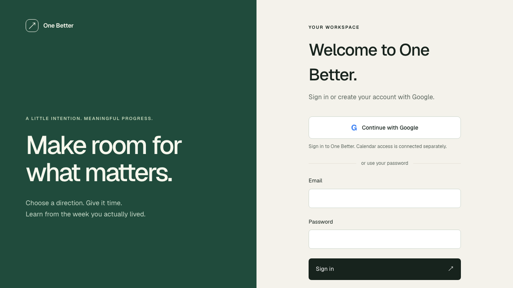
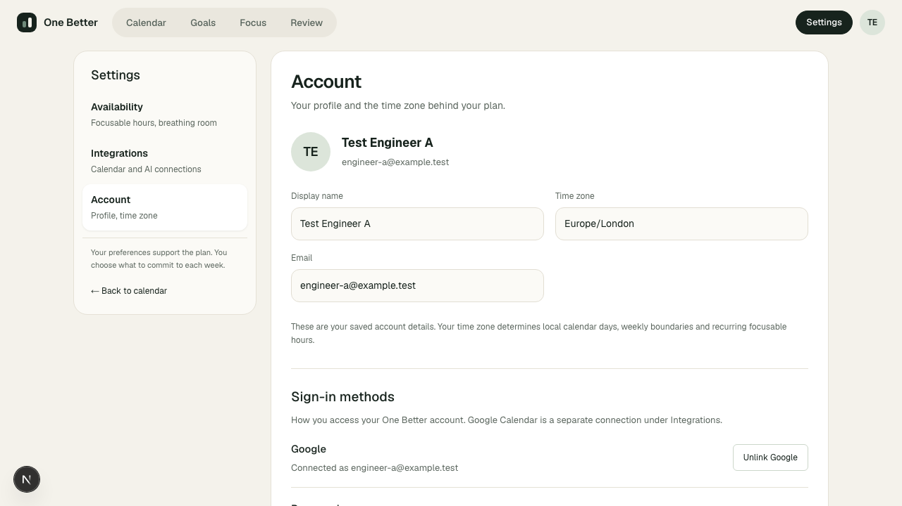
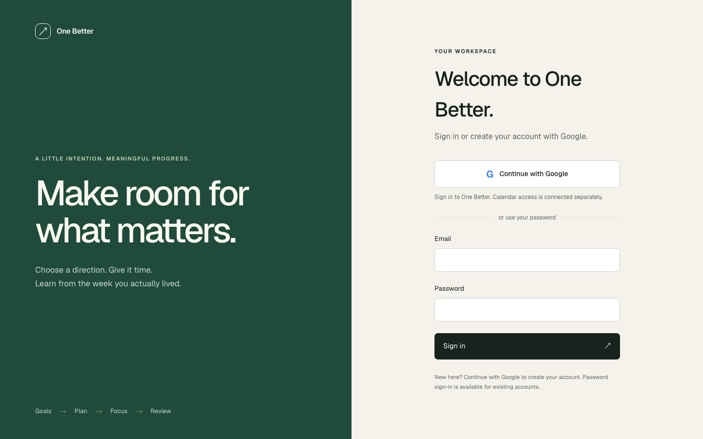

# Google Sign-In

Google signs into an existing One Better account or creates a new account for a verified Google email using Better Auth's built-in Google provider. Password login remains available for existing password accounts. Successful login opens Calendar; signing in does not connect Google Calendar.

## Configuration

Server-side development credentials are read from `.env.local`:

```dotenv
GOOGLE_AUTH_CLIENT_ID=
GOOGLE_AUTH_CLIENT_SECRET=
BETTER_AUTH_URL=http://127.0.0.1:3100
```

Use a Google **Web application** OAuth client with this exact authorized redirect URI:

```text
http://127.0.0.1:3100/api/auth/callback/google
```

The configured origin and browser origin must agree. `localhost` and `127.0.0.1` are different origins. Restart the app after changing credentials. Both dedicated credentials are required; missing or placeholder values disable the Google button and preserve password login. The current development client differs from the Calendar client. No secret is included in this document, a client prop, or a screenshot.

`socialProviders.google` requests only `openid email profile`, with default scopes disabled, `accessType: online`, `includeGrantedScopes: false`, and account selection. It does not request offline access or Calendar scopes. Additional scope/authorization parameter injection is rejected at the HTTP boundary. Better Auth handles authorization-code exchange, PKCE, state, callbacks, session creation, and account linking; there is no custom OAuth implementation.

## Google signup and account linking

The user explicitly replaced the original provisioned-users-only policy on 4 October 2026: if the Google email is not in the database, create an account. Google's `disableImplicitSignUp` and `disableSignUp` are now `false`. Continue with Google signs in matching users and registers new verified Google identities through Better Auth. The validation hook rejects unverified Google emails before creation. The built-in ID-token route likewise requires a valid Google signature and verified email; no One Tap UI was added. Email/password signup stays disabled.

Better Auth links Google's verified email to an existing matching account. The application does not merge different-email accounts. A new email gets an independent user ID and an empty workspace, with the default `Europe/London` time zone and Google-provided profile. A Google-only account has no password and cannot unlink its sole authentication method. Subsequent sign-ins use that same user ID. The existing local test account, work, and integration connections are preserved separately.

Different-email linking is disabled. A validation hook additionally requires a verified Google email matching the existing database user on login/linking, including subsequent logins for an already linked Google subject. Google cannot replace an existing account's saved name or time zone. The database's existing `(provider_id, account_id)` unique index prevents one Google identity from belonging to two users. No schema migration is required.

**Provisioning policy:** CLI-provisioned local accounts initially have `emailVerified: false`. `requireLocalEmailVerified: false` permits the supported linking path for these trusted rows. Browser-accessible account creation is restricted to verified Google identities; unverified identities and password signup cannot pre-register someone else's email. Revisit this setting before adding another signup path or untrusted provisioning. Existing local users are not manually marked verified.

Settings → Account shows a minimal server-derived Sign-in methods section. An authenticated user can link Google using Better Auth's `linkSocial` API. Google can be unlinked using its local account-record ID only when the same user has a nonempty credential password; a null-password credential row does not count as usable. Foreign account IDs, anonymous requests, and credential-method unlink requests are rejected. Better Auth's fresh-session requirement still applies. The only usable method cannot be removed.

## Identity, Calendar, and token separation

Google sign-in stores identity in `auth_account` and uses the existing Better Auth sessions. Calendar retains its independent connection, encryption, scopes, consent, caches, and disconnect lifecycle in `google_calendar_connection`. ChatGPT retains its existing connection. Linking/unlinking sign-in methods never mutates either integration.

No Calendar API call occurs during Google authentication. The fake provider transport fails if authentication contacts an unexpected Google API. A browser test separately connects and disconnects a fake Calendar connection, then signs in again with Google; authentication remains available.

OAuth access/refresh tokens are encrypted through Better Auth's `encryptOAuthTokens`. Account-token cookies are disabled, browser localStorage is not used for credentials, and Settings receives only the owned record ID, display email, and password-availability boolean. Better Auth's public access-token/refresh-token endpoints are disabled. Its account-list response excludes tokens and password hashes. Better Auth manages ID-token storage; the server-side identity token is not exposed through the browser account DTO.

POST requests retain the existing exact-Origin check. OAuth errors are normalized to a small allowlist of friendly messages and redirect to sign-in; provider descriptions and unknown internal error codes do not reach the browser. Cancellation, wrong email, unverified signup, missing configuration, provider failure, and forged callback state have coverage.

## Version and security check

Installed Better Auth is pinned to **1.7.7**. Its [release notes](https://github.com/better-auth/better-auth/releases/tag/v1.7.7) include the ID-token `disableSignUp` correction and current OAuth-state security fixes. No package upgrade was necessary. The [pre-account hijacking advisory](https://github.com/better-auth/better-auth/security/advisories/GHSA-g38m-r43w-p2q7) and the installed source were checked when choosing the provisioned-account linking policy.

Provider and account-linking semantics were checked against the [Google provider documentation](https://better-auth.com/docs/authentication/google), [users/accounts documentation](https://better-auth.com/docs/concepts/users-accounts), and the installed 1.7.7 implementation.

## Automated verification

After the Google-signup policy amendment:

- Unit tests: **494 passed**.
- Database tests: **320 passed**, including 15 Google-auth scenarios with new-user creation, repeat sign-in, verified-email enforcement, signed/forged ID-token checks, password signup denial, ownership isolation, and sole-method unlink protection.
- Google authentication and Settings browser checks: **9 passed**.
- Lint, typecheck, documentation check and production build: **PASS**.
- Production process restart proof: **PASS** for existing and newly registered Google accounts, persisted sessions, new saved work, fresh sign-ins, and isolation between accounts.

Fake OAuth tests use signed Google-issuer JWTs, one-use codes, state, exact callback checks, and PKCE. No normal test requires live Google credentials. Test runners inject unmistakably synthetic credentials and a Node preload transport confined to a randomly named loopback `execution_test_<suffix>` database. Production runtime does not import the fake transport.

Run the browser suite with `npm run test:e2e -- tests/e2e/google-auth.spec.ts`. Run the focused production stop/start proof after building with `npx tsx --env-file=.env.test scripts/prove-google-auth-restart.ts`; it is also included in `npm run test:restart`. Tests wait for Better Auth's rate-limit retry window rather than disabling production throttling.

Synthetic UI evidence:





## Live QA

Dedicated credentials are present and separate from Calendar. Before live login, a private read-only snapshot captured the existing user identity and ownership counts/ID digests for Goals, Milestones, Actions, Focus Cycles, Weekly Plans, TimeBlocks, Focus Sessions, Daily/Weekly Reviews, Calendar, and ChatGPT connections. Reflection text and credentials were not read.

The original live sign-in reached the expected signup-disabled error because the saved development account uses `local@example.test`. The user's subsequent instruction enables a new account for their real verified Google email. No account email or ownership has been manually changed. The old workspace stays separate; there is no pending requirement to rename it.

Live Google registration/login and connected Settings screenshots are pending the rebuilt signup-enabled app and the user's authenticated Google interaction. Do not treat synthetic evidence as a live Google PASS.

The signup-enabled app is running at `http://127.0.0.1:3100`. The user's sign-in tab was refreshed without the old signup-disabled error. The new wording explains that Continue with Google creates an account for new users.



## Limitations

Registration is supported only through verified Google identities. Email/password signup remains disabled. Google email changes require account-policy review; a mismatched email is rejected even for a previously linked subject. New accounts use the existing default `Europe/London` time zone. Missing configuration requires server restart after setup. Google controls consent, tester access, callback registration, and provider availability. Calendar permission consent remains a separate action. No One Tap, Workspace SSO, account-merging UI, passkeys, magic links, or new AI capability is implemented.
