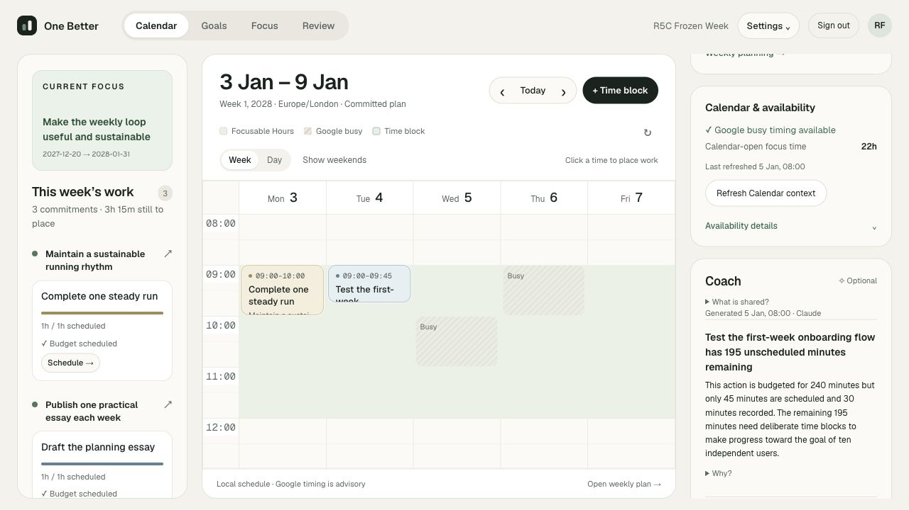
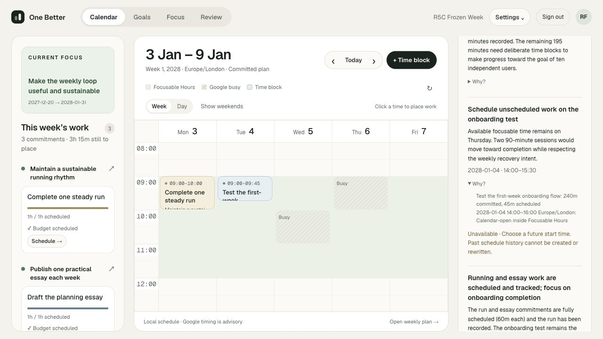
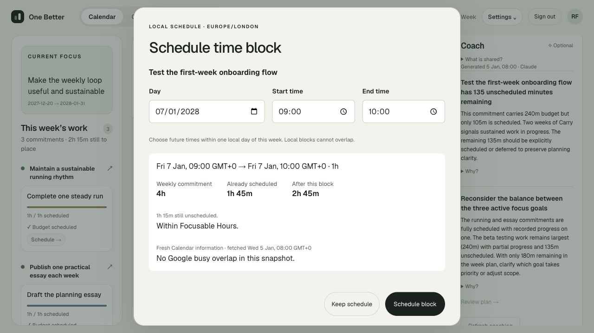
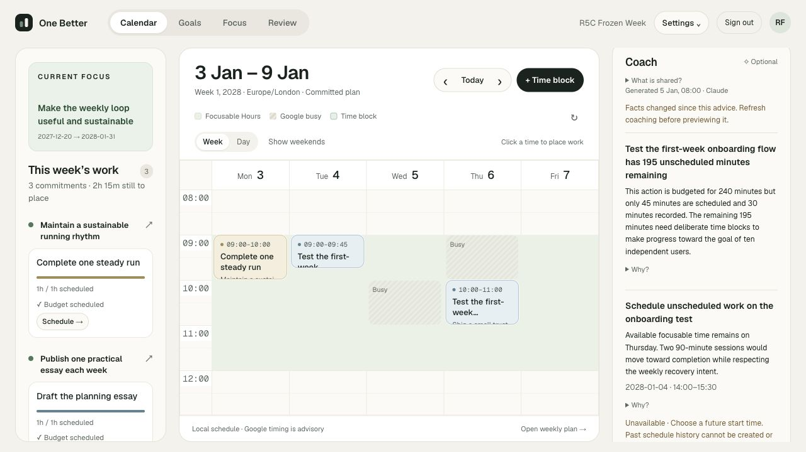
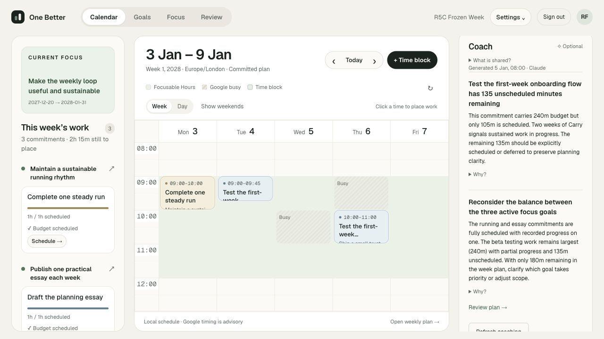
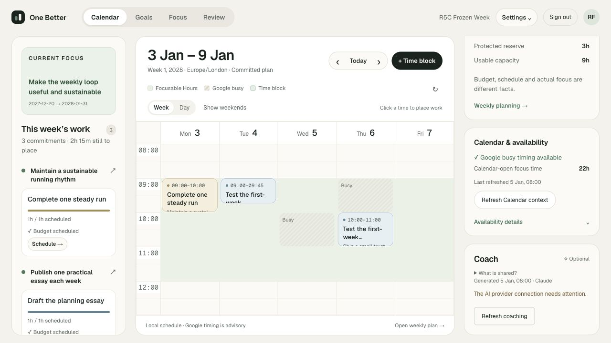
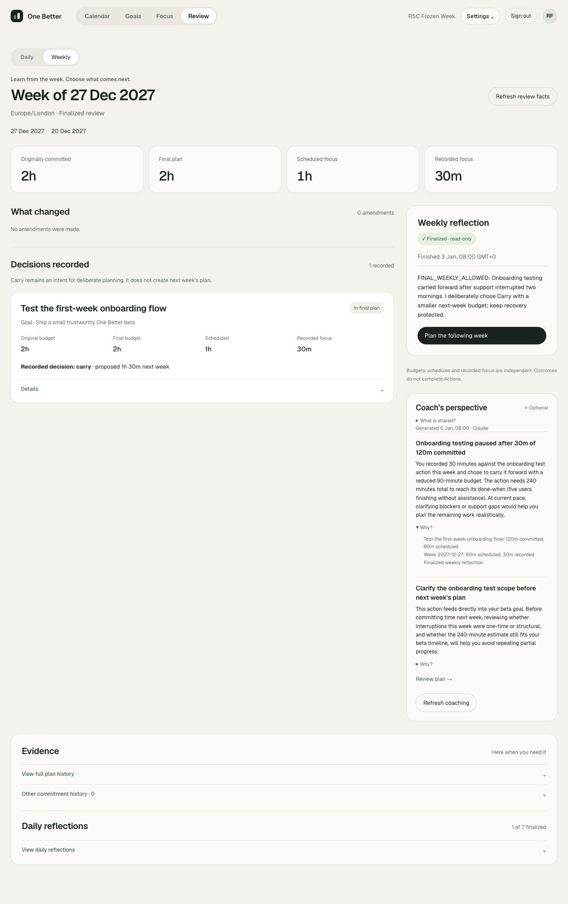

# R5C — Live AI Quality Gate

3 October 2026. **Partial live evidence; gate not passed.** Claude Haiku 4.5 successfully used the existing Anthropic adapter, but scheduling legality, factual grounding in prose and abstention failed human review. OpenAI is **not live tested**: its API key and model were absent. This report does not claim a completed two-provider comparison or select a winner.

## Configuration and scope

Configured the user-requested lower-cost Anthropic model in server-side `.env.local`:

```dotenv
ANTHROPIC_MODEL=claude-haiku-4-5-20251001
```

The Anthropic key was present. No secret is included here. `OPENAI_API_KEY` and `OPENAI_MODEL` remained absent. The isolated QA process explicitly selected `AI_PROVIDER=anthropic`; it used the ordinary production build on loopback port **3104**, a disposable database and a process-owned test clock. The normal port-3100 app was left running. Real Google credentials were cleared from the QA process; availability was synthetic cached FreeBusy data, with no Google calls.

| Provider | Exact model | Endpoint | Live evidence |
| --- | --- | --- | --- |
| Anthropic | `claude-haiku-4-5-20251001` | `https://api.anthropic.com/v1/messages` | Six successful calls; one deliberate invalid-key authentication failure |
| OpenAI | Unconfigured | Existing adapter targets `https://api.openai.com/v1/responses` | Zero calls; no compatibility, cost or quality conclusion |

The existing SDKs are `@anthropic-ai/sdk@0.131.0` and `openai@7.27.0`. Calls used the existing `output_config.format` JSON schema, 4,096 output-token limit, zero SDK retries, 25-second SDK timeout and 30-second application timeout. No tools were supplied. Anthropic documents this model and its structured-output support: [model catalog](https://platform.claude.com/docs/en/models/overview), [structured outputs](https://platform.claude.com/docs/en/build-with-claude/structured-outputs).

**No production source, provider adapter, prompt, recommendation schema/type, migration, AI capability, UI, agent or background generation was changed.** Changes are development configuration, explicit QA scripts, synthetic fixtures and documentation. No genuine provider-adapter compatibility bug was found, so no adapter fix was justified.

The user asked whether OAuth could replace the missing OpenAI key. OpenAI now documents [Sign in with ChatGPT plan usage](https://developers.openai.com/siwc/token-sharing-open-source) for eligible open-source/local apps. This is a separate integration: registration/consent, tokens/renewal and [streaming request requirements](https://developers.openai.com/siwc/token-sharing-open-source/preview-limitations). The current adapter uses non-streaming Responses, string input and `max_output_tokens`; OAuth requires streaming, array input and omission of that field. OAuth was **not implemented or used** during this validation-only phase, and no existing Codex credentials were read or repurposed.

## Frozen scenario and provenance

The exact synthetic packets, IDs and fingerprints are saved in [scenario.json](r5c-evidence/scenario.json). The main fixture freezes the product clock at **5 January 2028, 08:00 UTC**, Europe/London; current week **3–9 January 2028**, finalized Review week **27 December 2027–2 January 2028**. Future synthetic dates allow ordinary wall-clock scheduling checks in the UI; deterministic QA services use the frozen clock. Production HTTP context fingerprints were checked against the exported provider packets before screenshots: [Calendar verification](r5c-evidence/ui-calendar-verification.json), [Review verification](r5c-evidence/ui-review-verification.json).

One active Focus Cycle, **Make the weekly loop useful and sustainable**, selects three Goals. Intent: ship a small useful beta, maintain recovery, share a concrete lesson and preserve breathing room.

| Goal / current commitment | Budget | Scheduled initially | Recorded |
| --- | --- | --- | --- |
| Ship a small trustworthy One Better beta / Test the first-week onboarding flow | 4h | 45m | 30m partial session |
| Maintain a sustainable running rhythm / Complete one steady run | 1h | 1h | 1h completed session |
| Publish one practical essay each week / Draft the planning essay | 1h | 1h, Thursday 14:00–15:00 | No session yet; future block |

Committed plan: **12h provisional capacity, 3h protected reserve, 9h usable capacity, 6h committed budget and 3h unallocated usable capacity**. Initially 2h45 scheduled and 1h30 recorded. Budgets, schedules, session outcomes and Action completion are separate facts.

Focusable Hours: Monday–Friday 09:00–12:00 and 14:00–16:00. Synthetic busy intervals: Wednesday 10:00–11:00, Thursday 09:00–10:00, Friday 14:00–15:00. The cache is fresh at the frozen clock; it supplies 22h of Calendar-open Focusable windows across the whole week, including elapsed days. Existing local TimeBlocks still require independent overlap checks.

Prior week: onboarding had a 2h commitment, 1h scheduled and 30m recorded partial execution. Its finalized Weekly Review contains **one human Carry decision**, proposing 90m for the following week. A still older week has a draft Weekly Review and no Carry decision. It must not be interpreted as a second Carry.

The main Calendar, initial restraint and Review cells were each generated once against their exported frozen packets. OpenAI never ran against them. The scripts are ready to perform a fresh two-provider comparison when both providers are configured; current observations must not be misrepresented as that comparison.

Prompt SHA-256: `6fdda7fa5f038861c29696de40a60e4cb3acb01a7fd3aad0e0beb47f1a2b02ef`.

Schema SHA-256: `9b297a8bc080591b30f8ed2afadd71f88e544278b96e769815affc196da88421`.

These remained identical on every call, including the additional restraint check. No prompt was tuned to favor a provider.

## Setup corrections and additional sample

The first successful live Calendar call preceded UI verification. The QA database name used an extra underscore that failed the existing isolated test-clock guard. Corrected **only the QA database name and fixture guard**, recreated the disposable fixture and retained the first call in [preflight evidence](r5c-evidence/preflight/results.json). The initial result is disclosed below and included in costs; it was not discarded to improve apparent quality. The failed fixture-start attempt made no provider call. No production guard was weakened.

The initial well-planned fixture had three fully scheduled 1h commitments, two completed 1h Focus Sessions and a future essay block, with ample breathing room and no Carry. However, onboarding retained a 4h Action estimate despite its deliberate 1h budget. That could justify scope review and confounded the abstention check. Its original output remains in [results.json](r5c-evidence/results.json).

Ran a separately labeled **clean restraint sample**, with the same three-goal pattern, all estimates/budgets/scheduled durations matched at 60m, two completed sessions, no Carry and the essay already scheduled for Thursday. Its exact packet/output is in [clean-restraint.json](r5c-evidence/clean-restraint.json). This is additional Anthropic evidence, not a substituted two-provider comparison. It still generated unnecessary scheduling and fabricated facts.

## Structured-output, reference and legality results

All six successful responses satisfied the application schema, used only supported `observation`, `schedule_time` and `review_plan` types, and had **all evidence keys and entity IDs present in their supplied context**. No fabricated IDs survived grounding. Recommendation counts were 2–3. No new recommendation types or direct mutations appeared.

That is **not** a semantic grounding pass. Unsupported natural-language claims did survive ID/schema validation and remain visible as saved advice. Examples: Thursday described for a Tuesday date, a nonexistent Saturday essay block and two weeks of Carry where only one finalized Carry exists.

All three returned scheduling proposals were rejected by deterministic validation because they began before the simulated current day. None received an actionable scheduling Preview or wrote a block:

| Sample | Proposed placement | Deterministic result |
| --- | --- | --- |
| Preflight Calendar | Tuesday 4 Jan, 14:00–16:00 | Past start; unavailable |
| Verified main Calendar | Tuesday 4 Jan, 14:00–15:30 | Past start; unavailable; prose says Thursday and two sessions |
| Clean restraint | Monday 3 Jan, 10:00–11:00, essay already scheduled Thursday | Past start; unavailable; unnecessary duplicate work |

**Legal AI scheduling proposals were not demonstrated.** The service successfully contained invalid proposals; the model failed the scheduling-quality requirement. No fabricated or modified proposal was used to produce a desirable screenshot. An ordinary explicit manual placement was independently legal inside Focusable Hours, without busy or local overlap, and its Preview remained usable even after provider failure.

## Latency, tokens and approximate cost

[Cost ledger](r5c-evidence/cost-observations.json). Prices checked against [Anthropic standard first-party pricing](https://platform.claude.com/docs/en/about-claude/pricing): $1/input MTok, $5/output MTok, $0.10/cache-read MTok. All returned cache-read counts were zero; no prompt cache-write policy was requested. Formula: `(input + 5 × output) / 1,000,000` USD.

| Sample | Latency | Input / output tokens | Recommendations | Estimated USD |
| --- | --- | --- | --- | --- |
| Preflight Calendar | 12.103s | 6,470 / 446 | 3 | $0.008700 |
| Verified Calendar | 5.901s | 6,429 / 441 | 3 | $0.008634 |
| Initial restraint, confounded estimate | 5.498s | 6,074 / 353 | 2 | $0.007839 |
| Finalized Weekly Review | 5.257s | 3,195 / 355 | 2 | $0.004970 |
| Clean restraint | 5.559s | 6,054 / 343 | 2 | $0.007769 |
| Regeneration after explicit placement | 5.769s | 6,619 / 361 | 2 | $0.008424 |
| Deliberate invalid-key failure | 0.204s | Unavailable | 0 | Not inferred |

**Seven real requests, six successful. Estimated successful text cost: $0.046336**, including the preflight and extra restraint sample. These are token-based estimates, not invoice amounts; taxes, discounts and account billing adjustments are excluded. Failure metadata did not contain usage or dollars. There was no agreed dollar cap; calls were explicit and bounded, with no retry loop or background generation. OpenAI cost/latency/token observations are unavailable.

## Human quality review

Every actual recommendation is reviewed below. Labels identify samples, not scores. Full titles, prose and Why? labels are retained in the JSON evidence. No numerical productivity/provider rating is assigned.

### Verified Calendar

| Recommendation | Grounding | Usefulness | Specificity | Actionability | Restraint | Why? evidence |
| --- | --- | --- | --- | --- | --- | --- |
| C1: 195 unscheduled onboarding minutes | Budget 240, scheduled 45, recorded 30 and goal outcome are supported. Unscheduled time is not unfinished-work proof. | Useful reminder to deliberately place or reconsider the budget. | Specific Action, Goal and current week. | Scheduling/replanning direction is clear; no placement. | Does not fill all 22h; “need time blocks” is too categorical. | Commitment supports the gap; execution supports tracking. Displayed labels omit the Goal outcome used in prose. |
| C2: Schedule onboarding test | Tuesday date conflicts with Thursday prose; one 90m proposal conflicts with two-session explanation. | Not useful as proposed. | References the correct commitment/open window but wrong temporal interpretation. | Blocked: past start. | Bounded duration, but unsupported extra-session language. | Cites real Tuesday opening; does not justify Thursday or two sessions. |
| C3: Running/essay scheduled; focus on onboarding | Both scheduled 60m, only run recorded, onboarding largest unscheduled: supported. Title “scheduled and tracked” may misleadingly include essay tracking. | Modest confirmation; repeats C1's priority. | Three selected Goals and current commitments. | General priority direction, no concrete next block. | Preserves other commitments; no new work. | Commitments support schedules; cited labels omit the recorded-run detail. |

### Initial restraint sample — disclosed confound

| Recommendation | Grounding | Usefulness | Specificity | Actionability | Restraint | Why? evidence |
| --- | --- | --- | --- | --- | --- | --- |
| S1: Essay scheduled but no recorded progress | Future Thursday block and zero recorded minutes supported. Two completed sessions are not proof of completed Actions. | Weak: no progress is expected before a future block; additional-time suggestion is unsupported. | Names the correct Action/date/done-when. | Vague suggestion to focus or add time. | No scheduling object, but creates needless concern. | Essay and execution facts support tracking, not a need for extra time. |
| S2: Reconsider onboarding scope | 240m estimate versus 60m budget and five-user outcome supported. | Potentially useful because of the fixture confound; cannot use this sample alone to judge abstention. | Exact Action, estimate and budget. | Human scope review link. | Offers scope reconsideration, avoids filling time. | Action/source/commitment justify the question. |

### Clean restraint sample

| Recommendation | Grounding | Usefulness | Specificity | Actionability | Restraint | Why? evidence |
| --- | --- | --- | --- | --- | --- | --- |
| Z1: Two commitments show completion | Two completed Focus Sessions supported. Claims that Actions are complete and essay is unscheduled are unsupported; essay has 60m scheduled. | Harmful summary of an already adequate plan. | Specific records, incorrectly interpreted. | No clear useful next step. | Introduces a nonexistent gap. | Cited facts contradict the unscheduled claim and do not prove Action completion. |
| Z2: Schedule essay to preserve momentum | Invents Saturday schedule; actual block is Thursday 6 Jan 14:00–15:00. Monday proposal is past. A block cannot guarantee completing the week. | Unnecessary duplicate scheduling. | Named Goal/Action but fabricated timing. | Rejected past placement. | Failed: invents additional work despite full scheduling. | Real IDs/open window; no evidence of Saturday or the need to add a block. |

**Abstention result:** zero proposals was allowed and encouraged by the unchanged prompt. The clean fixture nevertheless returned one scheduling proposal (rejected) and one inaccurate observation. Zero legal actionable scheduling proposals resulted from application rejection, **not model restraint**. The initial sample also returned a review-navigation recommendation. Neither sample returned an empty response.

### Finalized Weekly Review

| Recommendation | Grounding | Usefulness | Specificity | Actionability | Restraint | Why? evidence |
| --- | --- | --- | --- | --- | --- | --- |
| R1: Onboarding paused after 30m of 120m committed | Recorded 30m, budget 120m and prior user-chosen Carry/90m supported. “Needs 240m total” turns an estimate into certainty; progress pace cannot prove remaining effort. | Useful pattern with problematic certainty about duration. | Correct historical week and Action. | Clarify blockers/support gaps before replanning. | No schedule or rollover decision; recognizes an existing Carry. | Commitment, summary and finalized Weekly Reflection support the pattern; 240m estimate appears elsewhere in packet. |
| R2: Clarify onboarding scope | Goal linkage, interruptions and 240m estimate supported. No deadline was supplied; “beta timeline” is a question, not a factual date. | Useful bounded human question about one-time versus structural interruption. | Specific beta Action and Focus Cycle. | Review link, no mutation. | Does not choose Carry, Defer or Drop. | Cited Action/source/cycle explain relevance; omits the Weekly Reflection supporting interruptions. |

### Regeneration after explicit placement

| Recommendation | Grounding | Usefulness | Specificity | Actionability | Restraint | Why? evidence |
| --- | --- | --- | --- | --- | --- | --- |
| G1: 135 unscheduled onboarding minutes | Correct current budget 240 and scheduled 105. **Invented two weeks of Carry**; only one finalized Carry exists. | Correct gap is useful, fabricated pattern undermines it. | Current changed Action/week. | Schedule or reconsider is clear; no placement. | Keeps a deliberate choice, but unnecessarily urges scheduling/defer. | Commitment supports gap; execution label does not support two Carry decisions. |
| G2: Reconsider balance across Goals | Budgets, partial progress and one other recorded commitment supported. “Only 180m remaining” ambiguously describes unallocated budget as remaining time; there is no demonstrated overcapacity. | Weak: no constraint justifies changing the Goal balance. | Specific three Goals and their budgets. | Cycle review link; no concrete necessary change. | Avoids extra scheduling but creates needless reprioritization. | Commitment/cycle facts support relevance; cited labels do not justify capacity pressure. |

### Retained preflight Calendar output

| Recommendation | Grounding | Usefulness | Specificity | Actionability | Restraint | Why? evidence |
| --- | --- | --- | --- | --- | --- | --- |
| P1: 195 unscheduled minutes and prior Carry | Correct budget/schedule/prior recorded history. | Useful gap reminder. | Exact commitment/week. | Explicit scheduling or human reconsideration. | No calendar filling. | Commitment and prior-history facts support the claim. |
| P2: Schedule onboarding Tuesday 14:00–16:00 | Correct ID and supplied open window, but past date. | Invalid placement. | Correct Action, unsuitable date. | Rejected. | 2h bounded; cannot act. | Tuesday/Wednesday open-window references do not make a past slot legal. |
| P3: Review plan intent and 180m remaining | 180m unallocated usable budget and recovery intent supported. Wording “remaining” is ambiguous. | Generic confirmation with little additional benefit. | Names cycle/plan. | Human plan navigation. | Explicitly preserves breathing room. | Plan/cycle labels are relevant but thin justification for reviewing a sound capacity choice. |

## Privacy verification

The fixture asserts boundaries before calling either adapter, and the instrumented wrapper verifies the exact context hash at transmission. These are actual transmitted application packets, not reconstructed intended prompts.

- Calendar packets exclude **all reflection bodies and session end notes**, including finalized permitted Review text.
- Explicit Review includes only `FINAL_DAILY_ALLOWED` and `FINAL_WEEKLY_ALLOWED` text.
- `DRAFT_DAILY_EXCLUDED`, `DRAFT_WEEKLY_EXCLUDED`, `LATE_DAILY_EXCLUDED` and `SESSION_NOTE_EXCLUDED` are absent from Review. The late daily note was finalized after the finalized Weekly Review cutoff.
- Synthetic Google provider metadata/credentials are absent from both purposes; only normalized availability is supplied.
- Generation changed no upstream Goal/plan/TimeBlock/session/reflection/decision rows. Human Carry/Defer/Drop choices remained unchanged. Review output recognized an existing Carry without selecting a new rollover decision.
- Configured AI key values were checked for absence from saved evidence and `.next/static` assets. Keys were server-side only; no authentication headers/raw SDK error bodies were saved.

Application/reference grounding does **not** validate every prose claim; the unsupported claims above are explicitly recorded rather than described as a privacy/reference pass covering semantic accuracy.

## Staleness and failure verification

[Staleness evidence](r5c-evidence/stale.json): ordinary deterministic scheduling explicitly created onboarding Thursday 6 Jan **10:00–11:00**, within Focusable Hours, no busy conflict, no local overlap. Onboarding scheduled total changed **45 → 105 minutes**, unscheduled **195 → 135**. The immutable commitment budget remained 240m.

The old live Anthropic run's fingerprint became stale. Its scheduling Preview returned `COACHING_STALE`; the UI displayed “Facts changed since this advice.” No stale proposal was applied. Important limitation: that original proposal was **already unavailable because it was in the past**, so this does not establish the positive case of a previously legal live AI Preview becoming stale. No such live legal suggestion was available in these samples. There is no AI apply endpoint; ordinary accepted placements use deterministic validation. No existing recommendation was edited into a legal one.

[Regeneration evidence](r5c-evidence/regenerate.json) verifies that the next call used the changed context/fingerprint and correctly read 105m scheduled. It remained factually weak about prior Carry and Goal balance. No planning mutation accompanied regeneration.

The real Anthropic endpoint was called once with a deliberately invalid non-secret test key, using the same adapter. It produced a sanitized `authentication` failure in 204ms and zero recommendations. All upstream facts remained unchanged. Plan reads and a normal Friday 09:00–10:00 Preview worked. The UI showed the small provider warning alongside working Calendar/navigation; manual Preview was captured without saving another block. The real configured key was not removed or changed.

## Screenshots

All screenshots are from the existing production UI reading saved real-provider QA runs. Synthetic dates/account names and mock Google availability are disclosed above. Browser input automation for date/time fields did not update the React editor state reliably; selecting the actual Friday calendar slot provided a normal prefilled editor and successfully produced the manual Preview. No UI source changes were made.

| Requested evidence | Result |
| --- | --- |
| OpenAI Calendar coaching | **Unavailable:** no live OpenAI run; no fabricated substitute |
| Anthropic Calendar coaching | Captured |
| Why? evidence | Captured, including actual opening contradicted by proposal prose |
| AI scheduling Preview | **Unavailable:** every live scheduling suggestion was illegal; manual Preview captured separately |
| Stale advice | Captured after the ordinary explicit TimeBlock creation |
| Provider failure state | Captured after real authentication failure |
| Weekly Review coaching | Captured with finalized reflection and Why? evidence |

### Anthropic Calendar coaching



### Why? and unavailable past proposal



### Ordinary manual scheduling Preview — not an AI proposal



### Stale advice



### Regenerated coaching



### Real provider failure



### Weekly Review coaching



## Verification and remaining boundary

Preparation and live commands: [main harness](../scripts/r5c-live-quality-gate.ts), [explicit follow-up checks](../scripts/r5c-live-followup.ts), [synthetic fixture](../tests/r5c-scenario.ts). The main harness defaults to no API calls; `--live` enables explicit finite commands. It rereads local configuration only on an explicit command, so credentials can be added without secretly changing the frozen scenario. Each normal comparison cell is generated once. Follow-up calls are individually recorded rather than hidden rerolls.

The isolated QA process, browser tab and all owned disposable databases were removed after capture. The normal app remains independent. Evidence consists of synthetic context/output only.

| Check | Result |
| --- | --- |
| Stable frozen context, owned IDs, cycle/goals/plan/sessions/Carry | Passed fixture assertions |
| Purpose/cutoff privacy markers | Passed before transmission |
| Production HTTP Calendar/Review fingerprint correspondence | Passed |
| Anthropic structured output/application ID grounding | Passed in all six successful calls |
| Legal AI scheduling suggestions | **Failed:** three past proposals rejected |
| Natural-language factual grounding | **Failed:** unsupported weekday, schedule, Carry and completion claims |
| Clean well-planned abstention | **Failed:** unnecessary scheduling and inaccurate observation |
| Stale-run Preview rejection | Passed; positive formerly-legal live proposal case unavailable |
| Regeneration on updated facts | Current counts used; semantic errors remained |
| Real provider authentication failure containment | Passed, core tools usable |
| OpenAI live comparison, screenshots and staleness | **Not performed:** API configuration absent |
| TypeScript / QA-file ESLint / documentation checks | Passed |
| Targeted coaching unit regression suite | 40 tests passed across provider/service/domain suites; these are automated tests, not additional live calls |

No automatic winner, numerical productivity score or new phase is implemented/recommended. This sample is small and cannot establish general model quality. Calendar availability is synthetic; real Google integration quality and invoice billing are outside this evidence. Timeout/rate-limit/refusal behavior was not tested against real providers in this run; existing automated coverage is not presented as live proof.

**R5C remains incomplete and not passed.** Finishing it requires an OpenAI API key/model for the unchanged adapter and a fresh same-packet comparison, plus resolution or explicit acceptance of the observed quality failures. OAuth is separate implementation work and was not silently substituted for that missing comparison. No next product phase is recommended from partial evidence.
