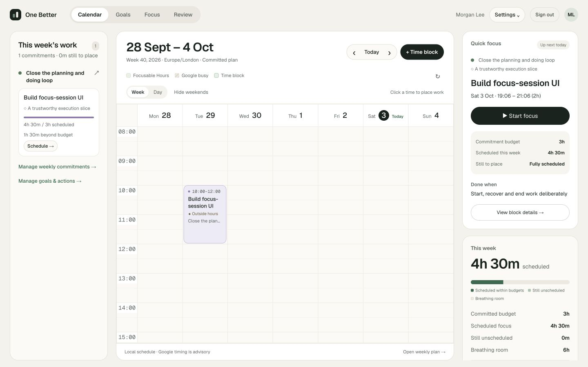
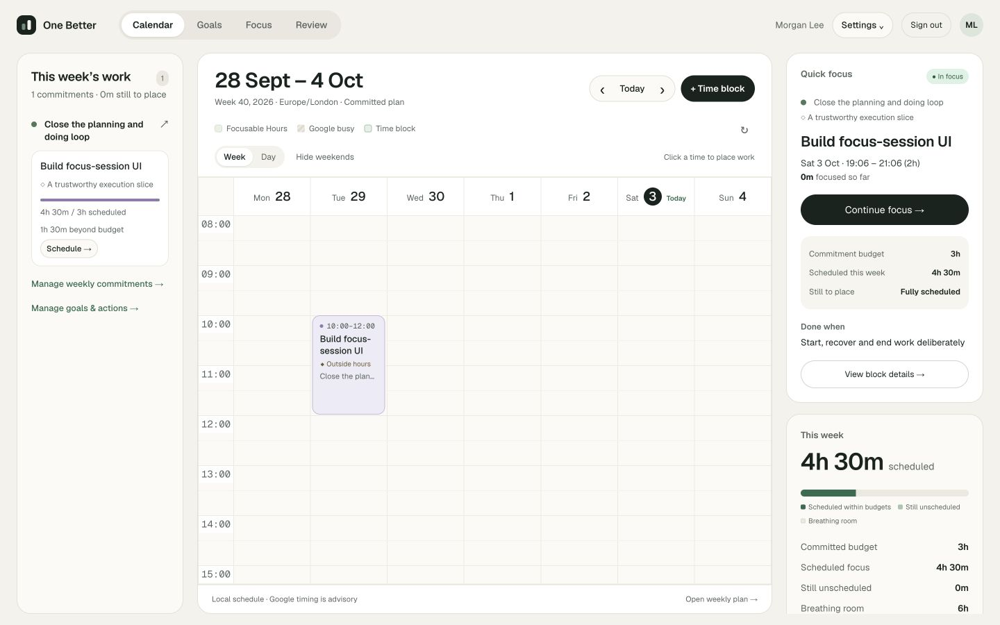
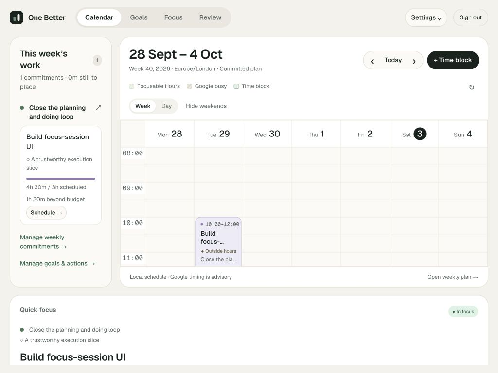
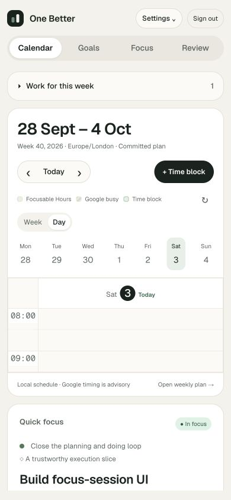

# Calendar work spacing and Quick focus

User-requested amendments to the calendar reference refinement.

The work rail uses the reference's 22px vertical / 20px horizontal padding. A later R2 rule had overridden commitment cards with zero horizontal padding; restored to 12px / 12px / 11px so titles, progress and controls sit inside the card border.

Quick focus appears at the top of the calendar context rail before a block is selected. It reads the existing owned Focus workspace and prioritizes a running session, then an eligible block scheduled now, then the next eligible block today in the displayed week. Blocks with ended sessions are not automatically suggested again. If none is eligible, the widget explains how to select a block or open Focus. An unavailable read offers recovery without hiding the saved calendar.

The widget shows real frozen Goal / Milestone / Action context, scheduled time, commitment budget, weekly scheduled minutes, remaining placement and doneWhen. Start goes into the existing explicit Focus flow; viewing the calendar never starts a session. Running sessions offer Continue. Selecting block details preserves the existing guarded reschedule/cancel controls; when a session is active, those details offer Continue current focus instead of another Start. Existing version, removed-commitment acknowledgment, single-active-session and idempotency rules remain in the domain services.

Focus context refreshes with the workspace, every 30 seconds while visible, and when the window regains focus. The calendar and rails retain their own scrolling; page height remains the viewport height at 1440×900, 1024×768 and 390×844, without horizontal overflow.

22 unique Calendar / Focus browser scenarios passed, including the new no-selection widget, active-session recovery, explicit-start navigation and mobile case. The two affected Start / Continue scenarios were rerun after the selected-details adjustment. Lint, TypeScript and production build passed. No schema, provider scope or domain-service changes.

Manual QA uses `scripts/ui-calendar-focus-walkthrough.ts`, a disposable real-time database/account without real provider calls. It verifies the eligible widget, starts one session deliberately, restarts the test process, recovers the same active session, and saves an honest partial outcome. Cleanup verifies original source, weekly baseline and planned intervals remain unchanged.

