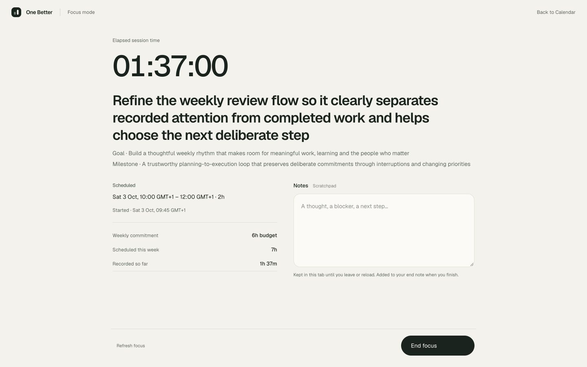
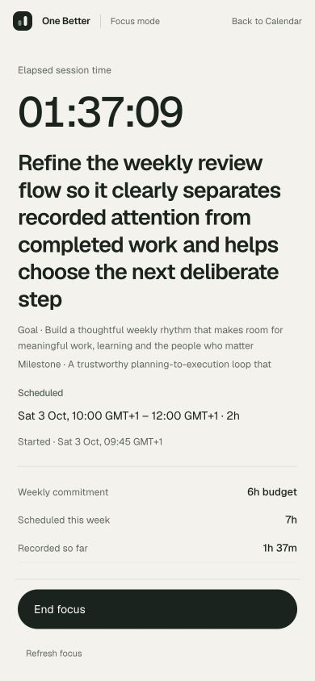

# UI Redesign R3 — Focus Mode

Completed 3 October 2026. R3 changes the presentation of the existing Phase 6A Focus Session commands and reads. No migrations, lifecycle states, domain services, provider operations or dependencies were added. Daily/Weekly feedback remains unchanged. R4 is a proposal only.

## Information architecture

Inactive `/focus` uses the normal One Better shell and asks **What am I focusing on next?** It reads today's owned, non-cancelled blocks in the User's timezone and sorts by original start time. The nearest current/upcoming unexecuted block becomes **Next**. **Later today** uses smaller cards; **Earlier today** is collapsed and retains recorded totals, immutable session history and the existing ability to start another eligible session. All cards use frozen Action/Goal/Milestone context. Calendar's explicit selected block remains discoverable, including read-only future-week or cancelled context; merely navigating never starts execution.

No blocks produces **Nothing scheduled for focus today.** / **Make room for important work from your Calendar.** with one **Open Calendar** action. No Actions backlog or Daily Review analysis is introduced.

## Active state and reduced shell

The server read determines the initial shell, so recovered sessions arrive directly in Focus Mode. Active mode has a small One Better mark, Focus mode indicator and a quiet Calendar escape. It removes primary navigation, settings, planning controls, availability/capacity/reserve summaries and the execution queue.

The centered workspace presents elapsed time, a prominent frozen Action title, Goal/Milestone, the original schedule and actual start, three compact commitment facts, scratch notes and End focus. Weekly facts are commitment budget, scheduled minutes and recorded elapsed time so far. They retain separate meanings. A neutral overrun message reports time beyond the original end without changing that interval or styling it as failure.

Desktop uses a schedule/context column beside the scratchpad, with generous whitespace. At 390px the hierarchy stacks; hero/context panels can scroll internally for long text, while the End focus footer stays inside the viewport. There is no document-level scrolling while active. The timer uses calm, tabular digits, without rings, percentages, alarms or scores.

## Start and end interactions

Normal eligible work starts in one click through the existing owner-scoped start command. Removed commitments show one small native dialog with the existing explicit acknowledgment. Its checkbox is focused; Start focus anyway stays disabled until checked. Keeping the schedule or Escape returns to the original Start control.

End focus opens a native dialog showing elapsed time so far and the Action, then asks **How did this session go?** The existing Completed as planned / Partial progress / Abandoned enum is used. Outcome selection receives focus; the optional existing end-note field is editable. Keep focusing or Escape retains edited notes in the scratchpad and returns focus to End focus. Pending uncertain commands keep their original mutation ID/body for exact retry and lock editing until resolved.

Successful completion shows a small duration/title/outcome acknowledgment, **Back to today**, **Back to Calendar**, and a quiet Choose another block option. Session history remains collapsed. It does not automatically complete the Action, infer progress, amend a budget or rewrite a TimeBlock. The acknowledgment itself is transient; persisted history remains available after reload.

## Timer, recovery and scratch-note behavior

Elapsed time reconstructs from persisted `startedAt`, the authoritative server sample and client elapsed time between reads. The display recomputes each second, with no timer-write requests. Existing visibility/focus recovery, BroadcastChannel notification and visible 15-second read refresh remain. Reload and production process restart recover the same session. The end timestamp and final duration still come from the server.

Scratch notes are React state tied to the active session ID in this tab. **They do not survive navigation, browser reload or tab closure.** The visible help explains this and an unload guard requests the browser's standard confirmation when notes are present. There is no localStorage, new persisted entity, autosave or periodic note-write request. Opening End focus prefills the existing end-note field; edited text is copied back when returning to work. Only a confirmed end command persists it. The existing 1,000-code-point trimmed end-note validation remains; long scratch text is retained and asks the user to shorten it before saving.

If another tab ends the session, unsaved scratch text remains available in this tab with an explicit unsaved-note message. It is not silently attached to a different session. The existing single-active-session conflict refreshes saved truth and offers Return to focus.

## Preserved invariants

The Phase 6A services, repositories, API contracts, enums and SQL are unchanged. The original 10 Focus browser cases remain, with navigation adapted to the reduced shell and the collapsed Earlier today section. Ownership, concurrency, exact retries, authoritative clocks, one active session, multiple sessions per block, execution lock, terminal immutability, removed/re-added commitment lineage, all outcomes and planning independence retain their original coverage. `recordedTime` remains compatible with Calendar, Daily and Weekly displays. The existing Daily Execution tests use the new visible End focus/navigation flow; its product UI is unchanged.

## Exact verification

| Command | Result |
| --- | --- |
| `npm test` | 353 domain/service tests; 26 files passed |
| `npm run test:db` | 263 real PostgreSQL tests; 12 files passed |
| `npm run test:e2e -- tests/e2e/focus.spec.ts tests/e2e/calendar-workspace.spec.ts` | 27 passed in 47.0s after final visual adjustments: 15 Focus + 12 Calendar |
| `npm run test:e2e -- tests/e2e/reviews.spec.ts` | 7 Daily Execution regression cases passed in 18.3s |
| `npm run lint` | Passed, zero warnings |
| `npm run typecheck` | Passed |
| `npm run docs:check` | Passed |
| `npm run build` | Optimized production build passed |
| `npx tsx --env-file=.env.test scripts/prove-focus-restart.ts` | Passed: real restart/reload at 37m; second restart replays original start/end receipts; one immutable session/two receipts; exact actual totals; source/planning/TimeBlock bytes unchanged; all Focus HTTP surfaces return 503 with unavailable PostgreSQL |

The 34 browser cases are the affected Focus/Calendar/Daily suites, not a claim that every repository browser test was rerun. Five added R3 cases cover ordered groups/reduced chrome/mobile footer, zero scratch writes and editable end-note handoff, reload warning/transient-note loss with persisted timer recovery, and Completed/Abandoned acknowledgment return routes. The existing Partial journey is retained. An initial old-markup assertion needed to expand Earlier today after reload; the final run passes without weakening its persistence/history assertions.

The normal production app was restarted with this build on port 3100 and health/sign-in checked. No normal user records or real Google connection were used for QA.

## Manual QA

`scripts/ui-r3-walkthrough.ts` seeds existing services into a disposable database, provides a guarded server test clock, and runs production on port 3104. Manual browser actions use real sign-in and real Focus commands. The fixture includes long labels, early/past/later blocks and a dropped commitment. Stop checks all outcome types and scratch persistence, compares complete source/baseline/amendment/TimeBlock rows, then removes its own process, database and clock file.

| Requested scenario | Observed result |
| --- | --- |
| 1. No blocks today | Exact empty copy and Open Calendar; no backlog |
| 2. One upcoming block | One Next card; no empty Later/Earlier sections |
| 3. Several blocks | Chronological Next/Later; Earlier collapsed |
| 4. Normal one-click Start | Direct start, active shell, no confirmation |
| 5. Review-required acknowledgment | Disabled confirmation until explicit keyboard checkbox acknowledgment; removed context retained while active |
| 6. Active session | Calm timer, frozen context, minimal facts and scratchpad; no main navigation/settings |
| 7. Early start | 09:45 actual start alongside untouched 10:00–12:00 schedule |
| 8. Late start | 14:17 actual start alongside untouched 14:00–15:00 schedule |
| 9. Beyond scheduled end | 17m beyond block shown neutrally; 2h32 elapsed after early start |
| 10. Browser reload | Same active session at 1h37 recovered |
| 11. Process restart | Real production process restarted, then same active session at 1h37 recovered; automated proof separately verifies 37m and exact retry receipts |
| 12. Long Action | Wrapped desktop/tablet/mobile; no horizontal overflow |
| 13. Long Goal/Milestone | Frozen labels retained; internal scrolling handles mobile overflow |
| 14. Completed | 28m recorded, explicit outcome and Back to today; Action unchanged |
| 15. Partial | 2h32 recorded with edited scratch end note; small acknowledgment |
| 16. Abandoned | 5m recorded for reviewed work; original plan/schedule retained |
| 17. Scratch → end note | Prefill matched; edited note returned through Keep focusing, then persisted on deliberate end |
| 18. Mobile active | 390×844 document height 844 and width 390; End focus remained within viewport with long labels |

Cleanup confirmed three ended sessions: Partial **9,120,000ms**, Abandoned **300,000ms**, Completed **1,680,000ms**. All Goal, Milestone, Action, complete weekly baseline/amendment history and TimeBlock rows remained byte-unchanged. Temporary viewport override and QA tab were cleared. Mobile QA is browser viewport emulation, not a physical-device/virtual-keyboard test.

## Screenshots

All show disposable data and the actual production build.

| Width | Inactive | Active |
| --- | --- | --- |
| 1440×900 | [Launchpad](screenshots/r3-focus-inactive-1440.jpg) | [Focus Mode](screenshots/r3-focus-active-1440.jpg) |
| 1024×900 | [Launchpad](screenshots/r3-focus-inactive-1024.jpg) | [Focus Mode](screenshots/r3-focus-active-1024.jpg) |
| 390×844 | [Launchpad](screenshots/r3-focus-inactive-390.jpg) | [Focus Mode](screenshots/r3-focus-active-390.jpg) |

Additional states: [one upcoming desktop](screenshots/r3-focus-single-1440.jpg), [one upcoming mobile](screenshots/r3-focus-single-390.jpg), [empty](screenshots/r3-focus-empty-1440.jpg), [removed acknowledgment](screenshots/r3-focus-acknowledgment-390.jpg), [scratch/end dialog](screenshots/r3-focus-end-390.jpg), [neutral overrun](screenshots/r3-focus-overrun-1440.jpg), [recorded result](screenshots/r3-focus-recorded-1440.jpg).

## Remaining friction and proposed R4

Scratch text deliberately disappears after confirmed navigation/reload; durable drafts need a separate authorized persistence decision. Long scratch notes must be shortened to the existing end-note limit. Very long frozen labels/context use internal scrolling on small screens; physical mobile keyboard behavior remains to be checked. The user must expand Earlier today to repeat a previously executed block. The existing 15-second cross-tab read cadence is retained.

Proposed R4 only: concise Daily/Weekly feedback with a short factual summary first and progressively disclosed session history, amendment/context details, reflection and rollover decisions. Preserve independent planned/scheduled/recorded facts and explicit existing save/finalize/rollover commands. No new backend functionality, inferred Action completion, AI, scores or automatic scheduling. R4 has not begun.
