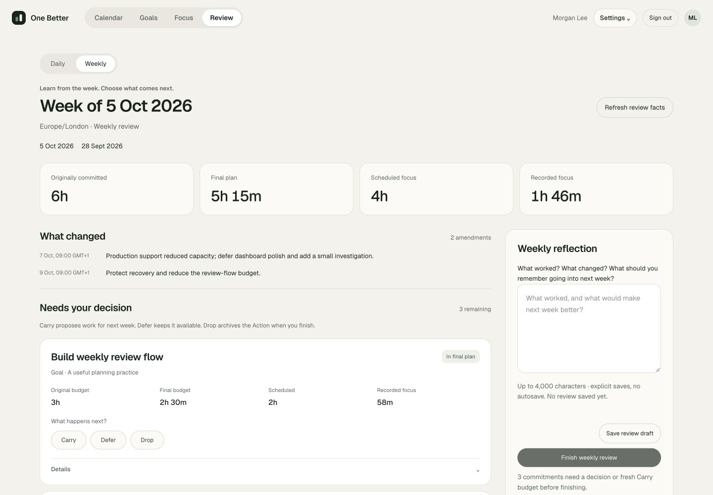
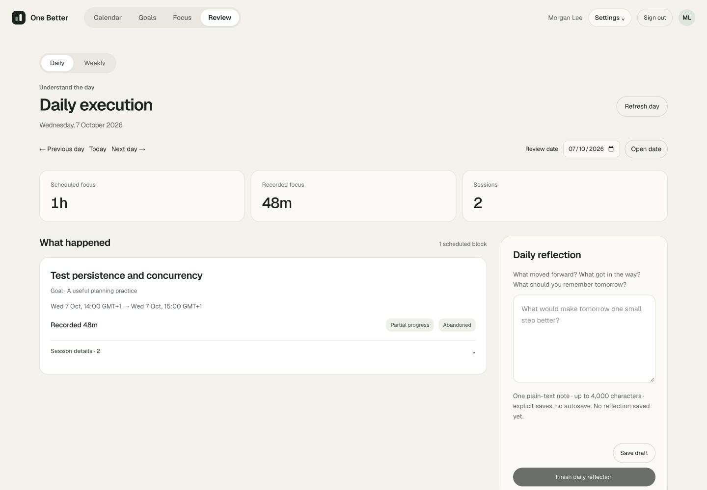

# UI Redesign R4 — Concise Daily + Weekly Feedback

Completed 3 October 2026. Presentation changes only on the existing Phase 6B/7A reads and commands. No database migrations, domain states, backend services, API contracts, providers or dependencies changed. Calendar remains the post-login home. No AI, Seasons, scheduling automation, Calendar writes or reopen/correction behavior was added.

## Primary content and progressive disclosure

Daily `/today` leads with **Scheduled focus**, **Recorded focus** (so far when live) and **Sessions**. What happened uses compact per-TimeBlock cards: frozen Action title, Goal, original interval, date-specific elapsed time and explicit recorded outcomes. Multiple outcomes remain visible together; duplicate outcomes display a count. **No focus session recorded** is factual. A block with sessions on other dates explains that distinction. Cancelled intervals remain marked and excluded from scheduled totals; work recorded against other scheduled dates retains its separate section.

Each card's initially closed Details contains full session timestamps, date-specific durations, outcomes, end notes, frozen Goal/Milestone/Action finish conditions, planning-timezone differences and the existing Focus link. Daily Reflection is prominent beside the work on desktop and below it on mobile. Existing explicit save, discard, conflict review, exact retry, active-session guard and finalization remain. Finalized text has a clear green **Finalized · read-only** label and ordinary readable typography.

Weekly `/review` separates three layers:

- **Summary:** Originally committed, Final plan, Scheduled focus and Recorded focus remain independent facts. What changed shows the latest two amendment reasons and dates; earlier reasons are expandable. No scores, charts, percentages or inferred Action completion.
- **Decisions:** Eligible or stale chosen commitments appear before detailed history. Each card exposes original/added and final/last budget, scheduled time, recorded time, Goal and selected Carry / Defer / Drop. Carry starts with a blank fresh budget; prior budget is context. Defer preserves availability. Drop explains archiving and still requires explicit acknowledgment in the finish dialog. Current renamed Action context and stale/ineligible choice removal remain visible.
- **Evidence:** Closed Details preserve frozen commitment context, original block intervals including cancellations, every relevant session and latest source context. Full plan history retains the original baseline and every complete amendment state, capacity/reserve, snapshots and budgets. Other commitment history retains resolved and removed work. Work from other planning weeks retains its original identity. Daily reflections retain all seven dates, finalized notes, missing/unfinished cases and the final-review cutoff.

The finish dialog shows the four summary facts, saved reflection and deliberate next steps, then the existing Drop acknowledgment. It does not repeat the complete evidence above the confirmation. Native disclosure controls support keyboard use. The shared `feedback-presentation` components provide metrics, details and final-state labels; scoped CSS leaves R1–R3 surfaces unchanged. The subtle Insights area says **Coming later** and contains no generated coaching or simulated recommendations.

## Preserved semantics

Review save/finalize handlers, receipt IDs, ownership, source-version guards, stale-context recovery, uncertain-command retries, unsaved navigation guards, polling and authoritative elapsed-time reconstruction remain in place. Existing domain/service and PostgreSQL tests were preserved. Reflection does not modify execution, budgets or schedules. Outcomes do not complete Actions. Carry records intent and a proposed budget; it does not create or insert work into next week's plan. Finalized notes and decisions cannot be edited or reopened.

## Verification

| Check | Result |
| --- | --- |
| `npm test` | 353 passed across 26 files |
| `npm run test:db` | 263 passed across 12 files; 26.27s |
| `npm run test:e2e -- tests/e2e/reviews.spec.ts tests/e2e/weekly-reviews.spec.ts` | 18 passed; 32.0s |
| `npm run lint` | Passed, zero warnings |
| `npm run typecheck` | Passed |
| `npm run docs:check` | Passed |
| `npm run build` | Optimized production build passed |
| `scripts/prove-review-restart.ts` | Passed: draft/reload, two real production restarts, original create/edit/finalize receipts, one terminal reflection, authoritative timestamp, unchanged planning/source/schedule/execution bytes; unavailable-DB APIs return 503 |
| `scripts/prove-weekly-review-restart.ts` | Passed: saved note/choices/reload, two real restarts, original receipts, exactly-once Drop, immutable review, unchanged Carry/Defer sources/history/execution/reflections, no automatic next plan; unavailable-DB APIs return 503 |
| `scripts/ui-r4-walkthrough.ts` | Passed after real manual save/reload/finalize and production restart; disposable database removed |

The 18 browser cases are the two affected review suites, not a claim that the entire browser suite was rerun. Their original fourteen cases retain ownership, conflict, retries, immutable history, live/midnight contributions, mobile keyboard interaction and persistence coverage. Four added R4 cases cover daily multiple outcomes and disclosed notes/context; factual no-session/read-only finalization; weekly completion with every evidence panel closed; and complete plan/resolved/session/cancelled/daily evidence. Markup-dependent locators were updated to the visible metric labels and direct decision buttons without removing behavioral checks.

An initial sandboxed unit run could not bind the existing Calendar fixture; the authorized local-network rerun passed. A disposable QA-script TypeScript annotation and disclosure-title locator ambiguity were corrected before the final successful build/browser run.

## Manual QA and responsive behavior

The production fixture on port 3104 uses synthetic accounts and existing domain services, with an isolated database and guarded test clock. No normal user data or real provider connection was used. Normal production on port 3100 was restarted with the completed R4 build and health/sign-in checked.

| Scenario | Observed |
| --- | --- |
| 1440×1000 | Broad summary strip, work/decisions left and compact reflection right; first decision visible without opening history |
| 1024×900 | Same two-column structure with narrower reflection; all metrics and controls fit |
| 390×844 | Summary → work/decisions → reflection → expanded evidence; no horizontal overflow |
| Original/final plan | 6h original, 5h15 final, 4h scheduled and 1h46 recorded shown separately |
| Several unresolved decisions | Three normal-week cards visible by default; choose fresh 90m Carry, Defer and Drop without expanding anything |
| Complete weekly review | Save, reload, explicit Drop acknowledgment, finalize, reload and production restart; all evidence stayed closed during completion |
| Finalized review | Readable saved note, recorded immutable choices, deliberate link to following-week planning; no automatic next plan |
| Multiple daily sessions | One block shows Partial progress and Abandoned, totaling 48m; disclosed notes/timestamps retain both attempts |
| Daily reflection | Save, reload, finish, reload and production restart retain the note and 48m summary |
| No session | Long-title block shows 1h scheduled, 0m recorded, 0 sessions and neutral factual copy |
| Many commitments | Ten historical identities, nine unresolved decisions, four amendments; latest reasons visible and two earlier reasons expandable |
| Long Action and Goal | Wrapped full titles and context at 390px without horizontal overflow |
| Missing Daily Reflections | All seven dates accessible; three finalized notes, an unfinished draft and three missing dates correctly distinguished |
| Historical evidence | Expanded baseline/amendments, resolved support work and daily notes; complete budgets, capacity/reserve and frozen context remain available |

The manual gate compared source, original baseline, commitment/amendment identity, schedule and Focus Session rows before and after the review. All compared bytes remained unchanged except the deliberately confirmed Drop Action and Daily Reflection. The proposed Carry budget was exactly 90m and the following week still had no plan. The QA process/database/clock file, browser tab and temporary viewport override were cleaned up. Mobile checks use browser emulation, not a physical device or virtual keyboard.

## Screenshots

All show actual production UI with disposable fixture data. Mobile captures are full-page to show ordering.

| Width | Daily | Weekly |
| --- | --- | --- |
| 1440 | [Daily](screenshots/r4-daily-1440.jpg) | [Weekly](screenshots/r4-weekly-1440.jpg) |
| 1024 | [Daily](screenshots/r4-daily-1024.jpg) | [Weekly](screenshots/r4-weekly-1024.jpg) |
| 390 | [Daily](screenshots/r4-daily-390.jpg) | [Weekly](screenshots/r4-weekly-390.jpg) |

Additional states: [finalized Daily](screenshots/r4-daily-finalized.jpg), [finalized Weekly](screenshots/r4-weekly-finalized.jpg), [many commitments and amendments](screenshots/r4-weekly-many-390.jpg), [long title / no session](screenshots/r4-daily-no-session-390.jpg).

## Remaining friction

Many actionable commitments still require vertical scrolling, especially on mobile; reflection follows the decisions there. This is deliberate ordering, with no bulk choice or inferred decision. Long amendment reasons can increase the summary height; full historical states remain verbose once opened. Carry uses explicit minutes rather than a new duration picker. Save remains explicit and finalization irreversible under the existing domain. Device keyboard and screen-reader testing remain separate from viewport/keyboard browser checks. A full real-week dogfood pass remains useful before authorizing new features.

## R5 proposal only

The product now has clear places for both active horizons and recommendations, but each needs a separately scoped domain/persistence decision.

**Seasons / active Goal horizons:** Goals is the primary place to choose a time-bounded set of active outcomes. Weekly planning could show that horizon as context when selecting commitments; Weekly Review could compare the decisions with those selected outcomes. Calendar should retain individual work as its primary content. Before implementation, decide whether a Season is a simple horizon filter or a persisted entity with its own membership/history, date boundaries and archive semantics. Historical weekly snapshots must remain unchanged when horizon membership changes. Avoid adding another obligatory planning step to the current loop.

**AI coaching/recommendations:** Review's reserved Insights area is a suitable entry after the factual summary and human reflection. Useful proposals could explain repeated overplanning, suggest decomposition or offer a smaller next-week commitment using cited recorded evidence. A recommendation must distinguish absent tracking from absent work, retain the evidence date/version, explain its reasoning and support accept/edit/dismiss. Accepted proposals must pass existing deterministic validation and user confirmation; the provider never directly edits schedules or Calendar events. A proposal to change a finalized plan must use the existing amendment workflow, not rewrite history. OpenAI/Anthropic stay behind a provider interface.

Recommended next step: dogfood the current loop first, then authorize one narrow R5 slice. Evaluate lightweight horizon context separately from an evidence-backed coaching proposal. No new Phase/R5 implementation is included here. Deeper Focus tooling is another independent future slice, not a prerequisite for using R4.
