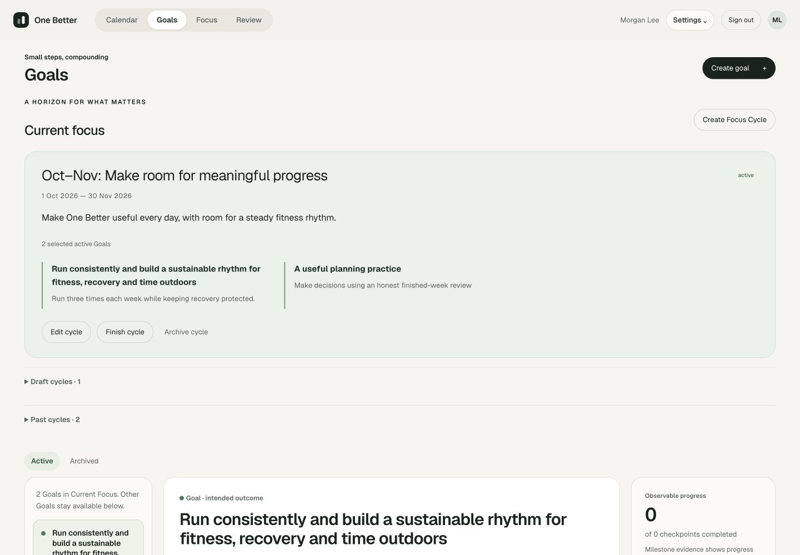

# R5A — Focus Cycles / Seasons

Completed 3 October 2026. A separate owned horizon now answers which Goals matter during the next few weeks. Goals leads with **Current Focus → selected Goals → existing Milestones/Actions**. Calendar and weekly planning use this context without rewriting or limiting deliberate work. Phase 0–7A and R1–R4 domain behavior is preserved. R5B is proposed only.

## Product behavior and lifecycle

A Focus Cycle has owned identity, title (1–160 Unicode code points), optional intent (up to 2,000), inclusive start/end local dates, status, version and authoritative creation/update/lifecycle instants. Select at most 50 distinct owned active Goals. Empty Drafts are allowed; activation requires at least one active Goal and dates covering the User's authoritative local today.

Draft → Active → Finished. Explicit Archive is available from Draft, Active or Finished. Draft/Active allow full metadata/membership edits with an expected version. Finished/Archived metadata and membership are read-only; Finished → Archived preserves the frozen context. No restore or destructive delete route exists.

There is **one Active cycle per owner**, an intentionally stronger rule than one date-current cycle. PostgreSQL's partial unique index and an owner command lock protect concurrent activation. An elapsed Active cycle ceases to be Current but remains Active until explicitly Finished/Archived. The Goals UI explains this and exposes those commands. Future Drafts never activate automatically. Active date edits must include today; finish and create a Draft to choose a different horizon. Deliberate removal of all membership is allowed without Goal archive.

Current uses `startDate <= User-local-today <= endDate`, including both boundaries. User timezone changes affect this live projection, without rewriting authored dates or Plan-pinned timezones. Reads and expiry cause no writes. There is no cycle-specific timezone, recurrence, nesting, score, weight or automatic prioritization.

Mutable cycles display current owned Goal titles/outcomes. Goal archive retains membership and marks it unavailable until explicitly removed; it does not finish the cycle. Selected stale/archived Goals cannot be saved atomically. Activation rechecks current Goal eligibility and captures live context. Finish/Archive captures Goal identity, version, title, outcome and archivedAt. Later Goal edits cannot relabel past cycles. Past Goal links open the live Goal workspace and say so.

## Goals, Calendar and weekly planning

Goals shows a warm Current Focus card with dates, intent, selected Goal outcomes and deliberate Edit/Finish/Archive controls. The existing detailed Goal workspace remains beneath it. Other active Goals, Draft cycles and Past cycles use native closed disclosures; Archived Goals retain their existing tab. An account without a cycle keeps its ordinary Goal workflow. An empty Active selection leaves Other Goals accessible rather than deleting/hiding them permanently.

Calendar's work rail displays Current Focus above This week's work. Current-cycle Goals appear by default; **Other committed work** exposes outside-cycle commitments with the existing Schedule controls. Draft work has equivalent secondary discovery. All scheduled blocks, cancellations, removed-commitment warnings and weekly facts remain visible and unfiltered. The time-block chooser still receives every eligible commitment. On mobile, the existing Work for this week disclosure contains the context; Calendar remains the post-login home.

Weekly planning shows Current Focus and labels candidate context as Current Focus Cycle or Other Goal available deliberately. Candidates are not filtered for eligibility. Existing baselines, amendments, budgets, estimates, capacity/reserve, scheduling, actuals and review evidence remain untouched. Context links are disabled while the existing Calendar/Planning editors prohibit navigation, preserving unsaved intent.

## Implementation and migration

[ADR 019](decisions/019-focus-cycles.md) records the decision. `src/modules/focus-cycles` contains pure strict schemas/rules, a small service and owner-scoped PostgreSQL repository; `src/server/focus-cycles.ts` supplies infrastructure and the existing authoritative clock. API routes are:

- `GET /api/focus-cycles`: owned workspace, Current projection and User-local today/timezone.
- `POST /api/focus-cycles`: create a Draft.
- `PATCH /api/focus-cycles/:id`: explicit versioned Draft/Active edit.
- `POST /api/focus-cycles/:id/activate`, `/finish`, `/archive`: explicit versioned transition.

Routes retain session-derived Actor, strict same-Origin mutations, bounded JSON, private/no-store reads and sanitized errors. Unsupported fields are rejected; foreign and missing cycles are indistinguishable. Client fields never author owner, snapshots, lifecycle or timestamps.

Additive [0012_focus_cycles.sql](../src/db/migrations/0012_focus_cycles.sql) creates only `focus_cycle` and `focus_cycle_goal`, owned composite FKs, a unique Active-owner index, field/date/lifecycle/time checks, version/identity/terminal update guards and terminal membership insert/update guards. Reviewed Drizzle journal/snapshot accompany it. SQL index creation precedes the composite FK that depends on it. Existing applied SQL is unchanged: all **12 earlier migration hashes matched** the normal local ledger. Fresh disposable databases and repeated migration are tested; the migration was applied to normal local PostgreSQL with `npm run db:migrate`. No seed cycle was added to the normal account.

Existing owner-scoped receipts include FocusCycle results. Hashes bind normalized content, sorted Goal selection/version guards, command kind, cycle ID and expected cycle version. Receipt and membership changes commit together. Same command replays its original result after later edits, finish/archive or restart. Reusing a key with changed fields conflicts. Ordered Goal row locks and cycle owner locks serialize version checks and activation; a rejected command writes neither partial membership nor successful receipt.

UI conflict recovery retains attempted metadata/selection, then explicitly reviews latest cycle/Goals before another intentional save. Uncertain acknowledgment locks fields and cancel/Escape, retaining the exact payload/ID for Retry same command. Native dialogs focus the title for editing and Cancel for transitions. Pending commands have an unload guard. Unsaved drafts/IDs remain in memory; after abandoning/reloading an uncertain create, inspect saved cycles before creating again. No offline storage or automatic save is introduced.

## Exact verification

| Command/check | Result |
| --- | --- |
| `npm test` | **369 passed**, 27 files, 967ms; includes 16 new Focus Cycle domain cases |
| `npm run test:db` | **277 passed**, 13 files, 27.80s; includes 14 new Focus Cycle PostgreSQL cases |
| Browser regressions listed below | **50 existing cases passed** in the combined 56-case run |
| `npm run test:e2e -- tests/e2e/focus-cycles.spec.ts` | **6 passed**, 12.2s in the final targeted rerun |
| `npm run lint` | Passed, zero warnings |
| `npm run typecheck` | Passed |
| `npm run docs:check` | Passed |
| `npm run build` | Optimized production build passed with the new authenticated routes |
| `npx tsx --env-file=.env.test scripts/ui-r5a-walkthrough.ts` | Passed: manual create/activate/edit/remove/finish, current and past context after real production restart, exact original create receipts and unchanged prior domain bytes |
| Normal local migration + restart | Earlier SQL hashes match; 0012 applied; production port 3100 restarted and health/sign-in/authenticated-route boundary checked |

The combined browser command was:

```bash
npm run test:e2e -- tests/e2e/focus-cycles.spec.ts tests/e2e/goals.spec.ts tests/e2e/goal-week.spec.ts tests/e2e/calendar-workspace.spec.ts tests/e2e/reviews.spec.ts tests/e2e/weekly-reviews.spec.ts
```

It ran 56 cases: all 50 existing regressions passed (9 Goals, 11 Goal-to-Week, 12 Calendar, 9 Daily and 9 Weekly), with one new ambiguous alert locator failing. The locator was scoped to its dialog. The targeted rerun then exposed a test teardown race after Finish; successful mutation completion is now awaited before fixture cleanup. The final six-case rerun passed. This is **56 unique passing browser cases across those runs**, not a claim of one fully green combined run or the entire repository browser suite. No hosted CI, physical-device or real-provider verification is claimed.

### New acceptance coverage

| Area | Automated evidence |
| --- | --- |
| Strict schema | 16 domain cases: trimmed title/optional intent, ten invalid or forged payload variants, duplicate/>50 membership, IDs/versions, strict transition fields, inclusive Current projection, activation/lifecycle/version rules |
| Migration and DTO | Repeat migration; empty workspace; saved Draft; no owner field exposed |
| Membership independence | Select/activate/remove/finish preserve exact Goal state/version; archived Goal stays context until explicit removal |
| Concurrency | Two activations with a shared Goal yield one winner; stale concurrent edits yield one winner; SQL unique index defends direct writes |
| Receipts | Five simultaneous duplicate creates give identical original results; create/activate/finish replay after Archive and a new connection; changed payload conflicts |
| Ownership | Foreign membership rejected; foreign/missing cycles return equal unavailable errors; composite SQL FK rejects cross-owner Goal membership |
| Atomic rejection | Changed/archived Goal guards reject without partial cycle/membership or successful receipt |
| Terminal context | Goal rename after Finish does not relabel history; Archive retains it; terminal metadata/member SQL updates rejected |
| Dates/timezones | Empty/future/past activation blocked; inclusive end; expiry does not write status/archive Goals; explicit Finish remains possible; Active date edits cover today; LA/Tokyo boundaries retain authored dates |
| Established loop | Exact prior Goal/Milestone/Action/Plan/Commitment/Amendment/Block/Session/DailyReflection bytes remain unchanged by cycle changes |
| UI lifecycle | Create, activate, edit selection, reload, finish, inspect past context and archive; outside Goal disclosure; Goal DTOs unchanged |
| UI conflict/retry | Two-tab stale edit retains attempt, explicit latest review enables save; lost create acknowledgment disables edits/cancel and retries one receipt |
| API boundary | Anonymous 401, missing Origin 403, forged fields 400, illegal lifecycle 409, unsupported Delete 405, foreign/missing 404, private/no-store |
| Calendar/planning/mobile | Outside work disclosed, current context shown, candidates remain eligible, no mobile horizontal overflow |

Tests are in [domain](../tests/domain/focus-cycles.test.ts), [PostgreSQL](../tests/db/focus-cycles.test.ts) and [browser](../tests/e2e/focus-cycles.spec.ts) files. Existing auth database inventory was updated solely to expect the two new tables.

## Production walkthrough and screenshots

The [walkthrough script](../scripts/ui-r5a-walkthrough.ts) used a new disposable PostgreSQL database, synthetic account and guarded October 3 clock on port 3104. Existing fixture services seeded Goal/Action/plan/amendment/block/session/reflection evidence, an archived September cycle and a future December Draft. Browser actions created a three-Goal October–November Draft, edited its dates, activated it, edited intent and removed the launch Goal, finished it, inspected frozen Past context, then created/activated a second two-Goal horizon. Reload and an actual production-process restart retained both current and past membership. December stayed Draft with disabled activation. Transition dialogs initially focused Cancel; edit focused the title. Long Goal titles wrapped and the mobile editor scrolled within its dialog.

On stop, the script reconstructed successful create receipt payloads and replayed them through a fresh database connection, comparing exact original results. It compared every existing owned row in Goal, Milestone, Action, WeeklyPlan, WeeklyCommitment, WeeklyPlanAmendment, AmendmentCommitment, CommitmentIdentity, TimeBlock, FocusSession, DailyReflection, WeeklyReview and WeeklyReviewDecision byte-for-byte. All were unchanged. Its own server/database/clock were removed and its browser tab/viewport override cleaned up. Normal user data and live provider connections were not used for manual QA.

| Viewport | Goals | Calendar |
| --- | --- | --- |
| 1440×1000 | [Current horizon after production restart](screenshots/r5a-goals-1440.jpg) | [Work rail and unfiltered calendar/facts](screenshots/r5a-calendar-1440.jpg) |
| 1024×900 | [Three selected outcomes with wrapped long title](screenshots/r5a-goals-1024.jpg) | [Current Focus at tablet width](screenshots/r5a-calendar-1024.jpg) |
| 390×844 | [Stacked Current Focus outcomes](screenshots/r5a-goals-390.jpg) | [Default collapsed work](screenshots/r5a-calendar-390.jpg), [expanded Current Focus context](screenshots/r5a-calendar-context-390.jpg) |

Additional states: [mobile selection editor](screenshots/r5a-editor-390.jpg), [retained past context](screenshots/r5a-past-1440.jpg). Captures are actual production viewport images; mobile Goals scroll vertically for long selected outcomes. Goals and Calendar had no horizontal page overflow at 390px. Tablet/mobile Goals captures show the first three-Goal horizon; desktop shows the second two-Goal horizon after restart.



## Remaining product friction and scope

Dates ending leave an explicit Finish/Archive step before another activation; this avoids hidden lifecycle changes. There is no automatic rollover of cycle membership. Many selected Goals or long outcomes increase vertical scrolling. Mobile Calendar retains its compact closed work rail by default; Current Focus becomes visible when that rail is opened. Current context refreshes on navigation or the existing Refresh controls; there is no new midnight cycle polling or background job. A cycle references live Goals while mutable, so editing a Goal changes its visible context; only terminal cycle snapshots retain historical wording.

Dialog drafts and pending IDs are transient. SQL update guards protect terminal rows/membership, and the app has no hard-delete route; privileged SQL DELETE/account erasure is not addressed. Viewport and native-keyboard checks do not claim physical-device, virtual-keyboard or full screen-reader testing. Google integration behavior remains the existing read-only advisory; no new provider calls, dependencies, AI proposals, scores or calendar writes were added.

## R5B proposal only — coaching over deterministic evidence

Start with a small read-only evidence packet: Current Focus and selected outcomes; owned open Actions/Milestones; original/effective weekly plan and amendment reasons; fresh/stale/unknown availability; accepted blocks; recorded sessions/outcomes; Daily Reflections and Weekly Review decisions. Preserve the distinction between no tracking and no work, estimates and budgets, scheduled and recorded time, live context and historical snapshots. Include source IDs, dates and versions so explanations can point to their evidence.

An OpenAI/Anthropic abstraction could return schema-validated **Recommendation** objects with rationale, cited evidence, a proposed action and referenced revisions. The user opens **Preview**, edits or dismisses, and explicitly accepts. Existing deterministic services then recheck ownership, current eligibility, versions, calendar coverage and scheduling constraints. A weekly-budget change uses the existing amendment workflow; a suggested block uses scheduling preview/confirmation. Stale evidence requires a refreshed preview. Recommendations cannot invoke providers or mutate calendars directly.

A useful initial scope would be one or two concrete proposals about unscheduled current-cycle commitments or repeated deliberate carry decisions, with clear evidence and no score. Define provider consent/data minimization, unavailable-provider behavior, recommendation persistence, idempotent acceptance and acceptance tests in a separate R5B brief. **None of R5B is implemented by R5A.**
