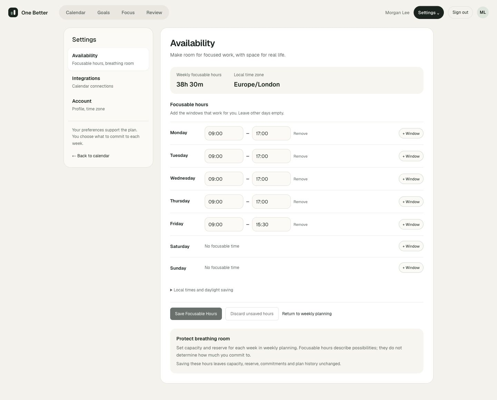
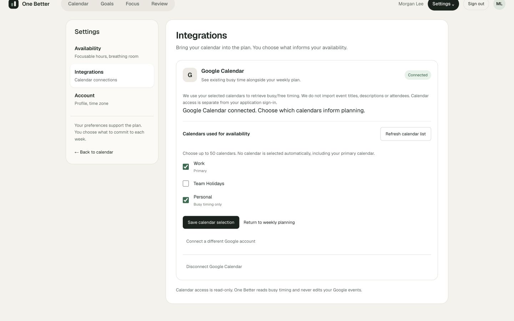
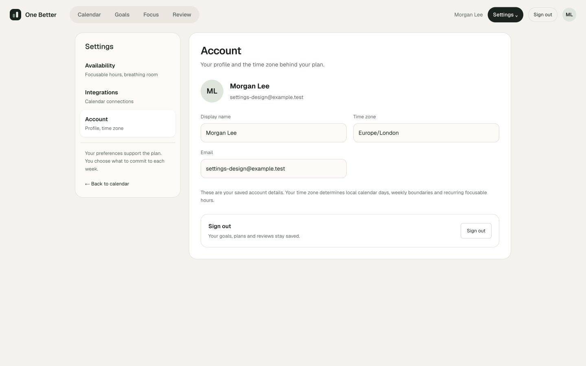
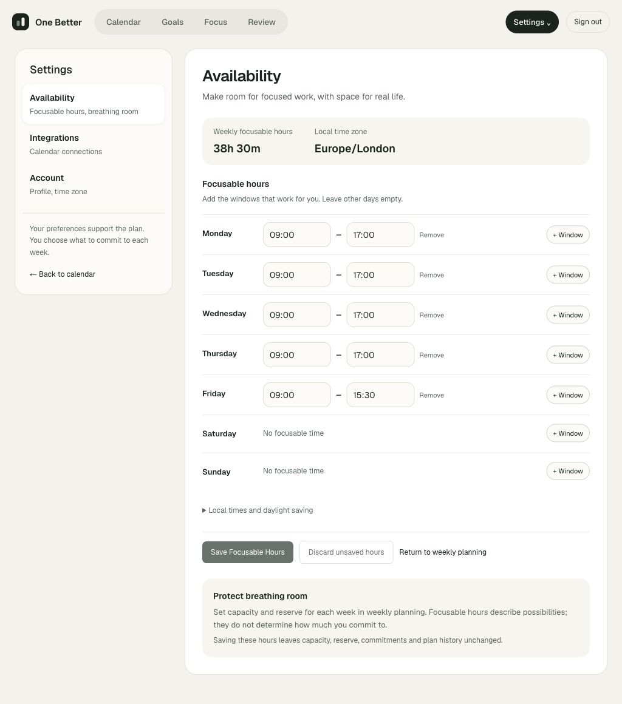
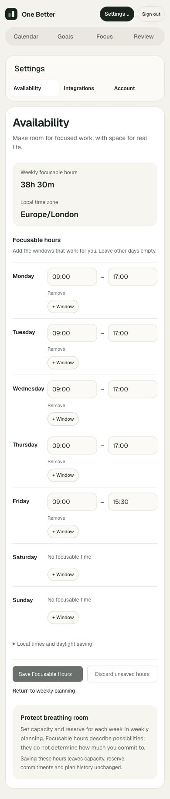
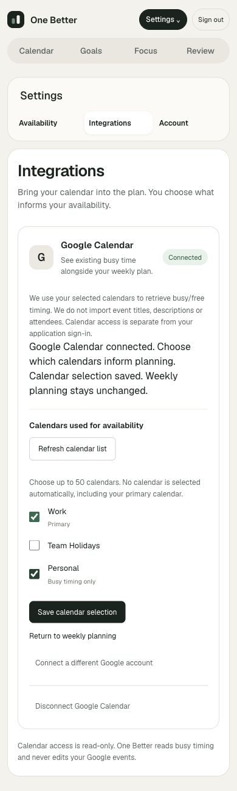

# Settings reference refinement

Implemented from the user-supplied `One Better - Settings.html` reference, composing existing preferences and Calendar controls.

## Design and interactions

- `/settings` opens Availability. A shared sidebar groups Availability, Integrations and Account; existing `/availability` and `/integrations` URLs and OAuth callback destinations remain valid. Mobile presents the three sections as a compact navigation row. Native links retain unsaved-form unload protection.
- Availability uses compact weekday rows, explicit multiple windows, empty days, a validated live weekly-hours preview and the account's saved time zone. The preview is labelled unsaved while editing; incomplete or overlapping windows show “Check times”. Save, discard, version-conflict review and identical uncertain-command retry remain intact. HH:mm text inputs retain support for 24:00 as an end.
- Integrations has a Google Calendar card with real connection status and existing consent, calendar selection, refresh, repair and confirmed disconnect. The return-to-planning link is unavailable while choices are unsaved or a command is pending. Calendar access remains read-only for busy timing.
- Account shows only the authenticated account's saved name, email and time zone, with the existing sign-out action. Profile editing, data export and account deletion are not implemented capabilities; no imitation controls were added.

Reserve remains a deliberate per-week planning value. Recurring wall-clock hours do not become usable capacity or alter plan facts. Reference Focus/Notifications controls, music, app/site blocking, Slack, Notion and AI connections are outside this presentation refinement. No persistence schema, provider scope, domain service or dependency changes.

## Verification

18 unique affected browser/HTTP scenarios passed: 7 Availability, 10 Calendar and 1 new Settings journey. The Settings journey dismisses a native navigation warning and proves unsaved hours and persisted facts remain intact, then verifies keyboard section navigation, account identity, responsive overflow and anonymous access. All 8 Availability/Settings scenarios were rerun after the final compact-control adjustment. Lint, TypeScript, documentation checks and production build passed. Existing unit/PostgreSQL suites were not rerun for this presentation-only change.

Manual QA uses `scripts/ui-settings-walkthrough.ts`, a disposable database/account and a loopback Calendar provider. It saves/reloads hours, connects/selects/reloads test calendars and checks 1440×900, 1024×768 and 390×844 layouts without horizontal page overflow. Fixture cleanup verifies weekly plan facts remain unchanged. No real Google requests or production-account mutations are performed.

## Screenshots

