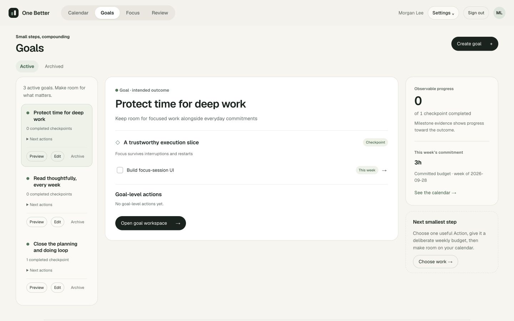
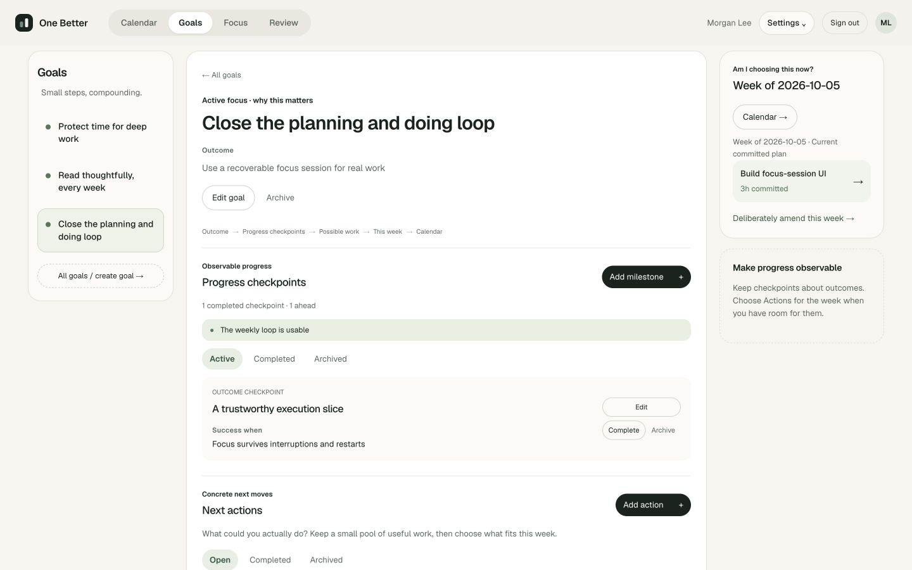
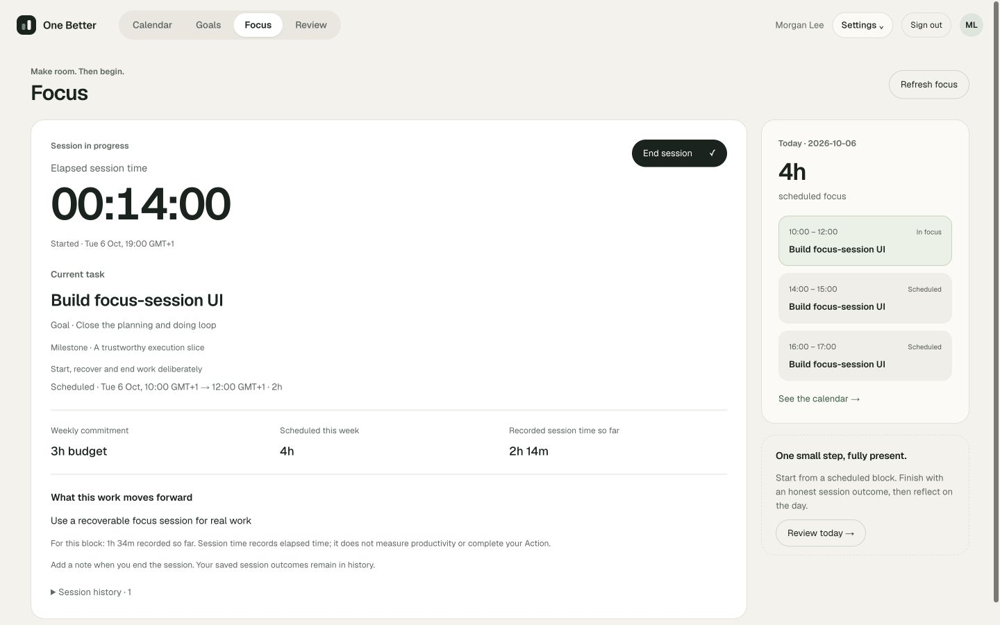
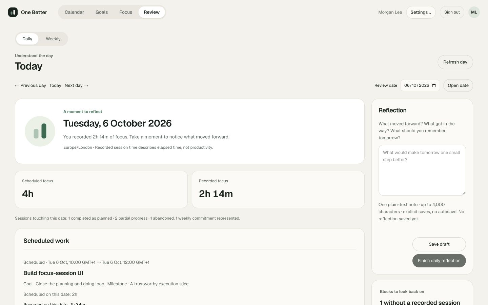
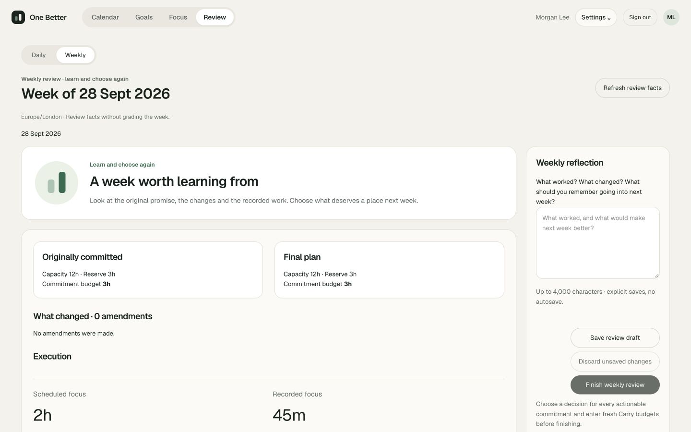
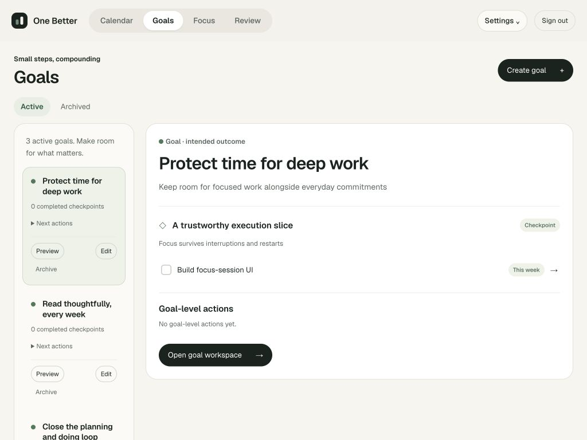
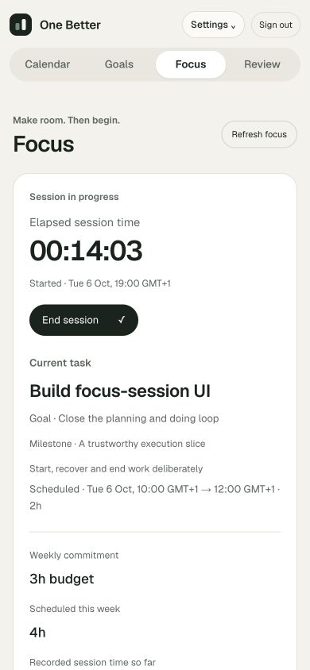
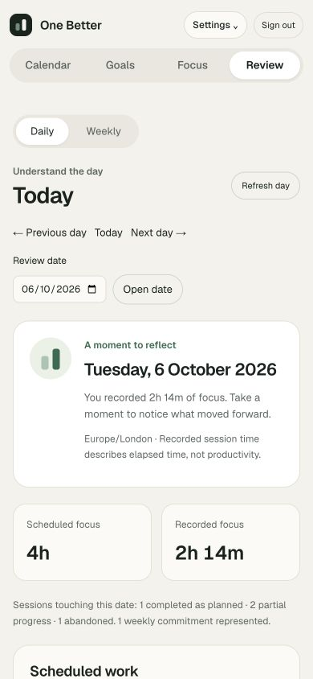

# Goals, Focus and Review reference refinement

Implemented from the user-supplied `One Better - Goals Focus Review.html` reference. This is a visual refinement of the existing Phase 0–7A product, following R2.

## Design and interactions

- Goals: compact selectable preview rail, grouped milestone/action preview, outcome surface and weekly context. Preview is read-only; open the goal workspace to edit checkpoints, capture Actions, complete work or choose a weekly budget. The full workspace keeps goal navigation, guarded editing and weekly planning in the same three-column visual shell. Active and archived views retain their existing behavior.
- Focus: large elapsed timer, current Action and frozen intended outcome, independent budget/scheduled/recorded metrics, saved session history and today's schedule rail. Start and End continue through the existing services and outcome dialog. The schedule rail identifies the active block without claiming that ended sessions complete Actions.
- Review: Daily / Weekly mode links, warm evidence cards, independent scheduled and recorded facts, reflection rail and a derived reminder for elapsed blocks without a recorded session. The daily reflection form leads its rail so Save / Finish are accessible immediately on desktop. Weekly evidence preserves the original baseline, amendments, daily reflections, commitment history and deliberate Carry / Defer / Drop decisions.
- Existing account identity is consistently shown across Goals, Focus and Review. Narrow screens stack panels; controls and dialogs remain usable without horizontal page overflow.

The demo reference's seasons, streaks, AI recommendations, shields, pause/resume, running notes and subtasks are not product capabilities. The UI uses real milestone evidence, weekly commitments, scheduled blocks and session facts instead. No inferred productivity scores or automatic scheduling/rollover were added. Reference checkbox shapes are read-only status marks in linked preview rows, not reversible completion controls.

## Persistence and scope

No migrations, package changes, provider changes or domain-service mutations. Existing ownership, source/version checks, exact idempotent retries, immutable plans/actuals, archive restrictions and reflection finalization remain in force. Full-document navigation retains existing native unload guards; Daily / Weekly mode changes explicitly refuse navigation while review text or decisions are dirty or a command is unconfirmed. Calendar's viewport layout is unchanged.

## Verification

58 unique affected browser/HTTP scenarios passed across Goals, milestones, Actions, weekly selection, Focus, daily review and weekly review. These include the new preview-selection/no-plan-write case, keyboard/mobile coverage, lost response replay, concurrent edits, immutable history, rollover and date/timezone boundaries. Two heading assertions were scoped to their intended surface because the goal title now appears in both the list and preview. The new navigation test also waits for the goal URL before asserting its heading.

Lint, TypeScript, documentation checks and production build passed. The existing domain/PostgreSQL suites were not rerun for this presentation-only change; their prior results remain recorded in the R2 report. No new persistence behavior was introduced.

Manual QA uses `scripts/ui-tabs-walkthrough.ts`, a disposable loopback database and account, with simulated execution dates and no real Google calls. The walkthrough starts and ends focus, saves/reloads/finalizes a daily reflection, and verifies all source/planning/block records remain unchanged. Responsive inspection covers 1440×900 desktop, 1024×768 tablet and 390×844 mobile. Screenshots contain fixture data only. The app on port 3100 was restarted and its health and sign-in endpoints returned HTTP 200.

## Screenshots

